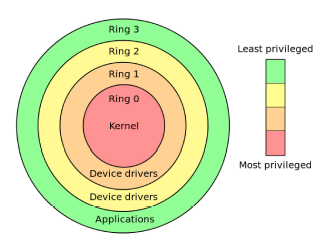
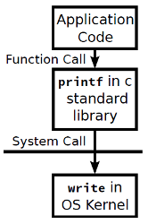
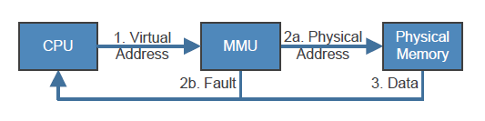
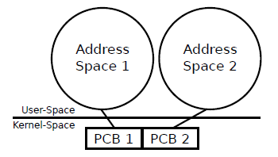
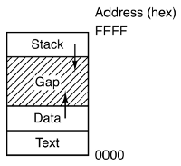

[zurück](README.md)

# 02: OS concepts

> 17.10.2017

## Table of Contents

- [Modes of Execution](#modes-of-execution)
- [OS Invocation](#os-invocation)
    - [System Calls](#system-calls)
        - [System Calls vs APIs](#system-calls-vs-apis)
        - [System Call Implementation](#system-call-implementation)
    - [Interrupts](#interrupts)
    - [Exceptions](#exceptions)
- [OS Concepts](#os-concepts)
    - [Physical Memory](#physical-memory)
    - [Virtual Memory: Indirect Addressing](#virtual-memory-indirect-addressing)
        - [MMU features](#mmu-features)
    - [Page Faults](#page-faults)
    - [Processes](#processes)
        - [Address Space Layout](#address-space-layout)
    - [Threads](#threads)

## Modes of Execution

- **User Mode** (x86: CPL3 / "Ring 3")
    - Only non-privileged instructions
    - Cannot manage hardware
- **Kernel Mode** (x86: CPL0 / "Ring 0")
    - All instructions allowed, e.g. privileged instructions like halt or interrupts

## OS Invocation

The OS Kernel does **not** always run in the background. Three occasions invoke the kernel and switch to kernel-mode:

- **System calls:** User-Mode process requires privileges, e.g. reading a file.
- **Interrupts:** CPU-external device sends a signal, e.g. when a network packet has arrived.
- **Exceptions:** The CPU signals an unexcepted condition, e.g. an invalid instruction or division by zero.

### System Calls

**Problem:** The kernel restricts processes to user-mode to protect them from each other. However now processes aren't able to manage hardware or other protected resources.  
**Solution:** The OS provides _services_ for hardware management etc. Applications perform _system calls_/_syscalls_, the OS checks permissions and performs action in kernel-mode on behalf of the application.

#### Examples (Linux)

- `open(file, how, ...)`
- `close(fd)`
- `read(fd, buffer, nbytes)`
- `write(fd, buffer, nbytes)`

#### System Calls vs APIs

Programmers often use _APIs_ which themselves use system calls internally.
Example: application calls `printf` function from library which uses the `write` syscall to write to the standard output buffer.

Most common APIs:
- **POSIX** for UNIX, Linux, macOS, etc.
- **Win32** for Windows

#### System Call Implementation

There is only one entry point for all syscalls: the **trap** instruction which switches the CPU to kernel-mode. The _system call dispatcher_ acts as a syscall multiplexer which identifies calls using a unique number. The _system call table_ maps these unique numbers to kernel functions. 

### Interrupts

Devices use interrupts to signal predefined conditions, e.g. a device controller informs the CPU that an operation is finished.

Interrupts are managed by the _Programmable Interrupt Controller_ (x86: APIC). Interrupts can be "masked" to defer their arrival. Due to a finite length of the interrupt queue, interrupts can get lost.

When an interrupt occurs, the CPU looks up an address in the _interrupt vector_ to pass the interrupt to the correct _interrupt service routing_ in the OS.

Notable examples:
- **Timer-Interrupt:** Periodically interrupts execution so that the Kernel can assure that every process gets enough execution time (among other things).
- **Network Interface Card (NIC):** Network package was received -> Kernel can forward package and free the NIC buffer

**Interrupts occur asynchronously.**

### Exceptions

Sometimes unusual conditions make further CPU processing impossible, e.g.
- Execution of a division with a zero denominator
- Write to read-only memory area
- Program jump to invalid instruction

When an unusual condition occurs:
1. An _exception_ is generated in the CPU
2. CPU interrupts process, gives kernel control
3. Kernel tries to resolve problem and continue faulting instruction or kills the process

**Exceptions always occur synchronously and in the contex of process.**

## OS Concepts

### Physical Memory

- Up to the early 60's: Programs were **directly loaded into physical memory**
    - Manual partitioning of code into _overlays_ if too big
    - No protection: every job (= process) could read and modify all memory
- Today: **Address Spaces**
    - Isolate bad processes in order to prevent damage, stealing of data or massive memory reservation
    - Idea: Give programs **illusion of having access to the complete memory**

### Virtual Memory: Indirect Addressing

Today, every CPU has a _memory management unit (MMU)_ built-in. It translates virtual addresses to physical addresses for every load and store operation.

#### MMU features:

- Kernel-only virtual addresses (kernel uses virtual addresses too)
- Read-only virtual addresses (for memory sharing across processes)
- Makes code injection harder (e.g. areas where execution is disabled; write-protecting the text section)

### Page Faults

The MMU issues a _page fault_ whenever a virtual address is accessed that isn't mapped to physical memory at the moment. The OS usually loads the faulting address and continues execution.

Page faults also occur on illegal memory accesses (e.g. application tries to access kernel or read-only memory).

### Processes

A process is a running instance of a program. Each process is associated with:

- A _process control block (PCB)_ containing information about allocated resources
- A virtual _address space (AS)_ consisting of all available memory locations for that process

#### Address Space Layout

Address spaces are laid-out in different sections. Memory addresses between sections are illegal, using them results in a page fault (more specifically called _segmentation fault_).

**Stack:** Function call history and local variables  
**Data:** Constants, static vars, global vars, strings  
**Text:** Program code

### Threads

Each process consists of >= 1 threads, each containing the following data:
- The _instruction pointer (IP)_ register stores the address of the currently executed instruction
- The _stack pointer (SP)_ stores the address of the top of the stack
- The _program status word (PSW)_ contains flags about execution history
- More: general purpose registers, floating point registers etc.
