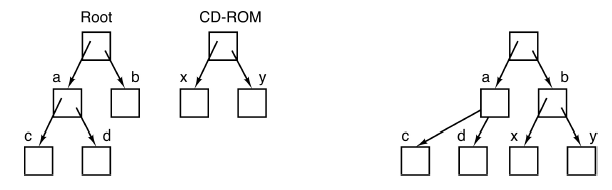

[zurück](README.md)

# 02: OS concepts

> 17.10.2017, 23.10.2017

## Table of Contents

- [Modes of execution](#modes-of-execution)
- [OS invocation](#os-invocation)
    - [System calls](#system-calls)
        - [Examples (Linux)](#examples-linux)
        - [System calls vs APIs](#system-calls-vs-apis)
        - [System call implementation](#system-call-implementation)
    - [Interrupts](#interrupts)
    - [Exceptions](#exceptions)
- [OS concepts](#os-concepts)
    - [Physical memory](#physical-memory)
    - [Virtual memory: indirect addressing](#virtual-memory-indirect-addressing)
        - [MMU features](#mmu-features)
    - [Page faults](#page-faults)
    - [Processes](#processes)
        - [Address space layout](#address-space-layout)
    - [Threads](#threads)
    - [Policies vs mechanisms](#policies-vs-mechanisms)
    - [Scheduling](#scheduling)
    - [Files](#files)
    - [Directory tree](#directory-tree)
    - [Storage management](#storage-management)

## Modes of execution

- **User Mode** (x86: CPL3 / "Ring 3")
    - Only non-privileged instructions
    - Can not manage hardware
- **Kernel Mode** (x86: CPL0 / "Ring 0")
    - All instructions allowed, e.g. privileged instructions like halt or interrupts

## OS invocation

The OS Kernel does *not* always run in the background. Three occasions invoke the kernel and switch to kernel-mode:

- **System calls**: User-Mode process requires privileges, e.g. reading a file
- **Interrupts**: CPU-external device sends a signal, e.g. when a network packet has arrived
- **Exceptions**: The CPU signals an unexcepted condition, e.g. an invalid instruction or division by zero

### System calls

- **Problem**: The kernel restricts processes to user-mode to protect them from each other. Hence processes are not able to manage hardware or other protected resources
- **Solution:** The OS provides _services_ for hardware management etc. Applications perform **system calls** (syscalls), the OS checks permissions and performs actions in kernel-mode on behalf of the applications

#### Examples (Linux)

- `open(file, how, …)`
- `close(fd)`
- `read(fd, buffer, nbytes)`
- `write(fd, buffer, nbytes)`

#### System calls vs APIs

Programmers often use _APIs_ which themselves use system calls internally.
For example: application calls `printf` function from library which uses the `write` syscall to write to the standard output buffer.

Most common APIs:

- **POSIX** for UNIX, Linux, macOS, etc.
- **Win32** for Windows

#### System call implementation

There is only one entry point for all syscalls: the **trap** instruction which switches the CPU to kernel-mode.
The **system call dispatcher** acts as a syscall multiplexer which identifies calls using an unique number.
The **system call table** maps these unique numbers to kernel functions. 

### Interrupts

Devices use interrupts to signal predefined conditions, e.g. a device controller informs the CPU that an operation is finished.
Interrupts are managed by the **Programmable Interrupt Controller** (x86: APIC).
Interrupts can be **masked** to defer their arrival.
Due to a finite length of the interrupt queue, interrupts can get lost.
When an interrupt occurs, the CPU looks up an address in the **interrupt vector** to pass the interrupt to the correct interrupt service routing in the OS.

Notable examples:

- **Timer-Interrupt**: Periodically interrupts execution so that the Kernel can assure that every process gets enough execution time (among other things)
- **Network Interface Card (NIC)**: Network package was received; now the Kernel can forward package and free the NIC buffer

**Interrupts occur asynchronously.**

### Exceptions

Sometimes unusual conditions make further CPU processing impossible, e.g.

- Execution of a division by zero
- Write to read-only memory area
- Program jump to invalid instruction

When an unusual condition occurs:

1. An **exception** is generated in the CPU
2. CPU interrupts process, gives kernel control
3. Kernel tries to resolve problem and continue faulting instruction or kills the process

**Exceptions always occur synchronously and in the contex of a process.**

## OS concepts

### Physical memory

- Up to the early ‘60s: Programs were **directly loaded into physical memory**
    - Manual partitioning of code into overlays if too big
    - No protection: every job (= process) could read and modify all memory
- Today: **Address Spaces**
    - Isolate bad processes in order to prevent damage, stealing of data or massive memory reservation
    - Idea: Give programs **illusion of having access to all memory**

### Virtual memory: indirect addressing

Today, every CPU has a **memory management unit** (MMU) built-in.
It translates virtual addresses to physical addresses for every load and store operation.

#### MMU features

- Kernel-only virtual addresses (kernel uses virtual addresses too)
- Read-only virtual addresses (for memory sharing across processes)
- Makes code injection harder (e.g. areas where execution is disabled; write-protection of the text section)

### Page faults

The MMU issues a **page fault** whenever a virtual address is accessed that isn't mapped to physical memory at the moment.
The OS usually loads the faulting address and continues execution.

Page faults also occur on illegal memory accesses (e.g. application tries to access kernel or read-only memory).

### Processes

A process is a running instance of a program.
Each process is associated with:

- A **process control block** (PCB) containing information about allocated resources
- A virtual **address space** (AS) consisting of all available memory locations for that process

#### Address space layout

Address spaces are laid-out in different **sections**.
Memory addresses between sections are illegal, using them results in a page fault (more specifically called **segmentation fault**).

- **Stack**: Function call history and local variables  
- **Data**: Constants, static vars, global vars, strings  
- **Text**: Program code

### Threads

Each process consists of one or more threads, each containing the following data:

- The **instruction pointer** (IP) register stores the address of the currently executed instruction
- The **stack pointer** (SP) stores the address of the top of the stack
- The **program status word** (PSW) contains flags about execution history
- More: general purpose registers, floating point registers etc.

### Policies vs mechanisms

- **Mechanism**: Implementation of what is done (e.g. the commands to put a HDD into standby mode)
- **Policy**: The rules which decide when what is done and how much (e.g. how often, how many resources are used, ...)

**Mechanisms can be reused even when the policy changes.**

### Scheduling

When multiple processes and threads are available, the OS needs to switch between processes to provide multitasking.

The **scheduler** decides which job to run next (policy) based on fairness and adhering priorities, the **dispatcher** performs the actual task-switching (mechanism).

### Files

The OS hides peculiarities of disks and other I/O devices.
Programmers use device-independent files and directories for persistent data.
A **file system** is used as an abstraction layer between files and directories and the actual storage hardware.
It translates directory and file names and data offsets to blocks.
Programmers operate on these files using file system operations such as `open`, `read` and `seek`.

Processes can communicate directly by using a **named pipe** file.
On Linux systems they can be created using `mkfifo`.
Writing and reading data on named pipes is equal to usual file operations except sent data will never be saved to persistent storage.

### Directory tree

Directories form a directory tree hierarchy.
The **root directory** is the topmost directory in the directory tree, files are specified by providing the **path name** to the file.

File systems can be **mounted** on a directory.
While on UNIX systems it’s common to combine multiple file systems into a single file hierarchy (right), Windows has seperate trees for multiple file systems that each use their own drive letter (left).

### Storage management

**Drivers** hide specific hardware peculiarities.
The OS can then provide an interface from abstract physical properties to logical units.

The OS can also increase I/O performance using

- **Buffering**: Store data temporarily while it's being transferred
- **Caching**: Store parts of data in faster storage
- **Spooling**: Overlay of output of one job with input of other jobs
