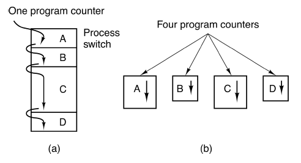
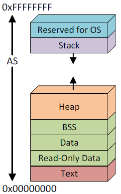

[zurück](README.md)

# 03: Processes, Address Spaces and Compiling, Linking, Loading

> 23.10.2017

## Table of Contents

- [Processes](#processes)
    - [The Process Abstraction](#the-process-abstraction)
    - [Concurrency vs. Parallelism](#concurrency-vs-parallelism)
- [Address Spaces](#address-spaces)
    - [Virtual Memory Abstraction: Address Spaces](#virtual-memory-abstraction-address-spaces)
        - [1. Fixed-Size Data and Code Segments](#1-fixed-size-data-and-code-segments)
        - [2. Stack Segment](#2-stack-segment)
        - [3. Dynamic Memory Allocation in the Heap Segment](#3-dynamic-memory-allocation-in-the-heap-segment)
    - [Typical Process Address Space Layout](#typical-process-address-space-layout)
- [Compiling, Linking and Loading](#compiling-linking-and-loading)

## Processes

Computers do several things at the same time using quick process switching (_Multiprogramming_).

A _program_ describes the memory layout and CPU instructions, a _process_ is the activity of executing a program. Multiple programs can solve the same problem, also the same program can be run multiple times at the same time using different CPUs (as several processes).

### The Process Abstraction

A _process_ is a container that contains all the information about the execution of a program. Conceptually, every process has its own "virtual CPU". The _dispatcher_ switches between processes, called a _context switch_. The current registers and memory mapping are saved and restored when switched back to the process.

### Concurrency vs. Parallelism

(a) **Concurrency/Pseudoparallelism:** Multiple processes on the same CPU  
(b) **Parallelism:** Processes truly running at the same time on different CPUs

_This lecture will focus on concurrency._

## Address Spaces

### Virtual Memory Abstraction: Address Spaces

Every process uses its own _virtual addresses (vaddr)_. The _Memory Management Unit (MMU)_ relocates each load/store to _physical memory (pmem)_.

**+** MMU can enforce protection (mappings are set up in kernel mode)  
**+** Programs can see more memory than physically available (80:20 rule: 80% process memory idle, 20% active working set)  
**-** Special MMU hardware required

Code, data and state need to be organized within processes resulting in an _address space layout_. The compiler distinguishes between three kinds of data to store in different areas:

#### 1. Fixed-Size Data and Code Segments

Some data in programs never changes, memory for this data can be statically allocated when the process is created.

- The _BSS segment (**B**lock **S**tarted by **S**ymbol)_ stores statically-allocated and not-initialized variables. The entire segment is initially set to zero
- The _data segment_ is fix-sized and contains data elements such as global variables
- The _read-only data segment_ stores constant numbers and strings

#### 2. Stack Segment

Some data is naturally free'd in reverse order of allocation:  
`push(a)` -> `push(b)` -> `pop(b)` -> `pop(a)`

A stack makes memory management very easy. There is a fixed starting point of the stack segment, the `stack pointer (SP)` points to top of latest allocation.

In current CPUs, stack segments typically grow downwars:  
**Allocate:** `SP -= a; return (SP + a);` (`push` CPU instruction)  
**Free:** `SP += a;` (`pop` CPU instruction)

#### 3. Dynamic Memory Allocation in the Heap Segment

Some data needs to be allocated and free'd dynamically "at random", e.g. input/output with unknown size. Usually memory is allocated in two tiers:

**1.** Allocate large chuck of _heap_ from OS using the base address + _break pointer (BRK)_.  
A process can get more memory or give it back by setting BRK using a system call (e.g. `sbrk()` in Linux).

**2.** Dynamically partition large chuck into smaller allocations using `malloc()` and `free()` in any order.  
This part happens in user-space, no need to contact the kernel.

### Typical Process Address Space Layout

- **OS:** Addresses where the kernel is mapped (cannot be access by process)
- **Stack:** Local vars, function call parameters, return addresses
- **Heap:** Dynamically allocated data (`malloc`)
- **BSS:** Uninitialized local vars declared as static
- **Data:** Initialized data, global vars
- **RO-Data:** Read-only data, strings
- **Text:** Program, machine code

## Compiling, Linking and Loading

_todo_