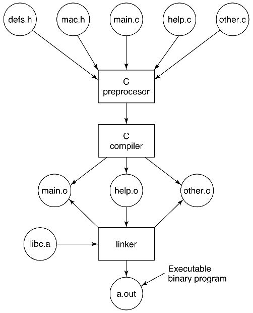
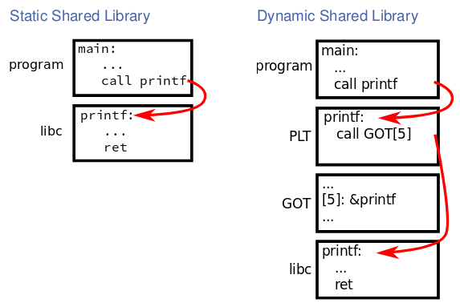

[zurück](README.md)

# 03: Processes, Address Spaces and Compiling, Linking, Loading

> 23.10.2017, 24.10.2017

## Table of Contents

- [Processes](#processes)
    - [The Process Abstraction](#the-process-abstraction)
    - [Concurrency vs. Parallelism](#concurrency-vs-parallelism)
- [Address Spaces](#address-spaces)
    - [Virtual Memory Abstraction: Address Spaces](#virtual-memory-abstraction-address-spaces)
        - [1. Fixed-Size Data and Code Segments](#1-fixed-size-data-and-code-segments)
        - [2. Stack Segment](#2-stack-segment)
        - [3. Dynamic Memory Allocation in the Heap Segment](#3-dynamic-memory-allocation-in-the-heap-segment)
    - [Typical Process Address Space Layout](#typical-process-address-space-layout)
- [Compiling, Linking and Loading](#compiling-linking-and-loading)
    - [The C Programming Language](#the-c-programming-language)
    - [The C Build Process](#the-c-build-process)
    - [Linker](#linker)
        - [Dynamic Linking](#dynamic-linking)
    - [Executing A Program](#executing-a-program)
    - [Shared Libraries](#shared-libraries)
        - [Static Shared Libraries](#static-shared-libraries)
        - [Dynamic Shared Libraries](#dynamic-shared-libraries)
        - [Static vs. Dynamic Shared Libaries](#static-vs-dynamic-shared-libaries)

## Processes

Computers do several things at the same time using quick process switching (_Multiprogramming_).

A _program_ describes the memory layout and CPU instructions, a _process_ is the activity of executing a program. Multiple programs can solve the same problem, also the same program can be run multiple times at the same time using different CPUs (as several processes).

### The Process Abstraction

A _process_ is a container that contains all the information about the execution of a program. Conceptually, every process has its own "virtual CPU". The _dispatcher_ switches between processes, called a _context switch_. The current registers and memory mapping are saved and restored when switched back to the process.

### Concurrency vs. Parallelism

(a) **Concurrency/Pseudoparallelism:** Multiple processes on the same CPU  
(b) **Parallelism:** Processes truly running at the same time on different CPUs


_This lecture will focus on concurrency._

## Address Spaces

### Virtual Memory Abstraction: Address Spaces

Every process uses its own _virtual addresses (vaddr)_. The _Memory Management Unit (MMU)_ relocates each load/store to _physical memory (pmem)_.


**+** MMU can enforce protection (mappings are set up in kernel mode)  
**+** Programs can see more memory than physically available (80:20 rule: 80% process memory idle, 20% active working set)  
**-** Special MMU hardware required

Code, data and state need to be organized within processes resulting in an _address space layout_. The compiler distinguishes between three kinds of data to store in different areas:

#### 1. Fixed-Size Data and Code Segments

Some data in programs never changes, memory for this data can be statically allocated when the process is created.

- The _BSS segment (**B**lock **S**tarted by **S**ymbol)_ stores statically-allocated and not-initialized variables. The entire segment is initially set to zero
- The _data segment_ is fix-sized and contains data elements such as global variables
- The _read-only data segment_ stores constant numbers and strings

#### 2. Stack Segment

Some data is naturally free'd in reverse order of allocation:  
`push(a)` -> `push(b)` -> `pop(b)` -> `pop(a)`

A stack makes memory management very easy. There is a fixed starting point of the stack segment, the `stack pointer (SP)` points to top of latest allocation.

In current CPUs, stack segments typically grow downwars:  
**Allocate:** `SP -= a; return (SP + a);` (`push` CPU instruction)  
**Free:** `SP += a;` (`pop` CPU instruction)

#### 3. Dynamic Memory Allocation in the Heap Segment

Some data needs to be allocated and free'd dynamically "at random", e.g. input/output with unknown size. Usually memory is allocated in two tiers:

**1.** Allocate large chuck of _heap_ from OS using the base address + _break pointer (BRK)_.  
A process can get more memory or give it back by setting BRK using a system call (e.g. `sbrk()` in Linux).

**2.** Dynamically partition large chuck into smaller allocations using `malloc()` and `free()` in any order.  
This part happens in user-space, no need to contact the kernel.

### Typical Process Address Space Layout

- **OS:** Addresses where the kernel is mapped (cannot be access by process)
- **Stack:** Local vars, function call parameters, return addresses
- **Heap:** Dynamically allocated data (`malloc`)
- **BSS:** Uninitialized local vars declared as static
- **Data:** Initialized data, global vars
- **RO-Data:** Read-only data, strings
- **Text:** Program, machine code


## Compiling, Linking and Loading

### The C Programming Language

In 1966 Martin Richards created BCPL for building compilers and OS. 1969, Ken Thompson created B, a simpler version of BCPL for PDP-7. Later between 1969 and 1973 Dennis Ritchie developed C for PDP-11, which was highly influenced by B and is very well-suited for OS development.

C deals with the same objects that computers do: numbers, characters, addresses (pointers), arrays, structures, calls, jumps and conditional branches (functions, loops, if/switch, ...).

### The C Build Process



- _Headers (.h)_ are `#include`d, macros are expanded in the _preprocessor_ before passing a `.c` file to the _compiler_.
- The compiler translates every `.c` file into an object file (`.o`).
- The _linker_ combines all `.o` files to an _executable binary_. The `.o` files need _exactly_ one `main()` function (entry point for program).

### Linker

The linker (Linux: `ld`) builds the executable from object files by...
- ...constructing a global symbol table which maps labels to addresses
- ...patching addresses in code (called _relocation_)
- and finally writing the result to the binary file

In C, the label name is the function name -> function names must be unique (other languages allow _overloading_ of functions, C does not).

#### Dynamic Linking

You may want to load plugins (e.g. kernel modules) at runtime, this can be done using _dynamic linking_.

**_dyn\_square.c_**
```c
int dyn_square(int a)
{
    return a * a;
}
```

**_main.c_**
```c
void *dyn = dlopen("dyn_square.o", RTLD_LAZY);
int (*square)(int) = dlsym(dyn, "dyn_square");
square(42);
```

### Executing A Program

When starting a program, the loader...
- reads code/data segments from disk into buffer cache
- maps code read-only and executable
- inits rw-data and data sections (maps them accordingly)
- allocates space for heap (`sbrk`) and stack
- allocates space for BSS and nulls everything in it

In reality there are lots of optimizations:
- code/data already in cache? don't read it again
- stack space allocated when used
- BSS not allocated until used
- code lazily loaded when first used
- share code with already running processes

### Shared Libraries

"Everyone" links to the standard library, no need to have a copy of this library in _every_ executable.

Idea: Static shared libraries

#### Static Shared Libraries

- Define a shared library segment in all processes that use that library
- The linker links the executable against that segment but doesn't copy it into the binary file
- Share section among all processes by loading shared library into buffer cache once

**Problem:** All programs need the library at the same place in virtual address space. What if another lib occupies that space or the sum of all shared libs exceeds the address space?  
**Idea:** Dynamic shared libraries

#### Dynamic Shared Libraries

Dynamic shared libraries allow loading a library at any virtual address. However how do you call functions if the position varies?

Possible solutions: _Position-independent code (PIC)_
- Use a _procedure linkage table (PLT)_ that contains _stubs_ pointing to the GOT/functions that are linked in dynamically
- _Global offset table (GOT)_ maps stubs to functions in various dynamic libraries
- _Lazy dynamic binding_ links each function on it's first call, not at startup

#### Static vs. Dynamic Shared Libaries


