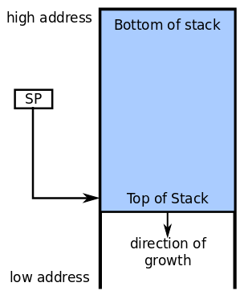

[zurück](README.md)

# 04: Process API

> 24.10.2017

## Table of Contents

- [Execution Model](#execution-model)
    - [Assembler (x86 Intel style)](#assembler-x86-intel-style)
    - [x86 Stack](#x86-stack)
- [System Calls](#system-calls)
- [Process API](#process-api)

## Execution Model

### Assembler (x86 Intel style)

The OS interacts directly with compiled programs. The following list is a set of (simplified) assembler instructions you should know.

- **mov**: Copy data from second operand to first operand

#### Arithmetic instructions

- **add, sub, mul, div**: add, subtract, multiply or divide two integer operands storing the result in the first operand  
- **inc, dec**: increment or decrement from register or memory location  
- **shl, shr**: bitshift left/right  
- **and, or, xor**: bitwise and/or/xor of two operands storing the result in the first operand  
- **not**: logical negation  

#### Control flow

- **jmp**: continue execution at given address  
- **je**: &ldquo;jump equal&rdquo; (jump if condition is true)  
- **jz**: &ldquo;jump zero&rdquo; (jump if operand is zero)  
- **call**: jump to a function (subroutine) by pushing current code location to stack  
- **return**:  return from subroutine (to return address on the stack)

#### Stack

The **stack pointer** (SP) holds the address of the top of the stack while the stack grows _downwards_. The SP points to the last allocated word (&ldquo;pre-decremented stack pointer&rdquo;).

- **push**: makes room for values on the stack by decrementing the SP and the inserting new element
- **pop**: cleans up values from the stack by incrementing the SP (removed data is not overwritten)

A **base pointer** (BP), also known as **frame pointer** (FP), can be used to organize larger chunks of the stack called **stack frames**.

## Application Binary Interface

The **Application Binary Interface** (ABI) standardizes communication between applications and the OS.
It may specify executable/object file layout, calling conventions, stack alignment rules etc. The **calling conventions** define the way function calls are implemented in order to achieve interoperatibility across compilers. In C, these conventions are (historically) called **cdecl**.

**Example**: SystemV AMD64 ABI (used in Linux, BSD and OS X)

### x86 calling conventions

When a function is called, the calling function

1. saves the state of the local scope
- sets up parameters where the called function can find them
- jumps to (*calls*) the called function

The called function then

1. sets up a new local scope
- runs its body (which may include calling other functions)
- puts the return value where the calling function can find them
- jumps back (*returns*) to the calling function

## Parameter passing and return codes

The system call number must be passed to the system along with the other arguments of the system call. The ABI specifies how to do that. Arguments can be transferred in different places:

- CPU registers (limit depends on how many registers there are)
- Main memory (heap or stack) for strings or if the registers are not enough

Arguments may also just all be transferred via main memory.

A **return code** needs to be returned to the application. Usually, negative numbers denote an error condition, positive numbers and zero denote success. Return codes are usually stored in the A and D registers.

### System call handler

When an application &ldquo;traps&rdquo; into the Kernel, the System call handler

1. saves registers that it will use
- reads passed parameters
- **sanitizes and checks those parameters**
- checks if the calling process has permission to perform the requested action
- performs the requested action on behalf of the process
- writes return value
- returns to the process

## Process API

Processes are started in a variety of ways, for example:

- Initialisation (&ldquo;boot process&rdquo;)
- By another process via a system call
- User requests a new process (e.g. opening files on the Desktop)
- Initiation of a batch job

But in the end all of those ways boil down to two mechanisms:

- The Kernel spawns an initial (user space) process on boot
    - Linux: **init**
- A process starts another process
    - POSIX: `fork`
    - Windows: `CreateProcess`

### POSIX process creation using `fork`

Every process has an unique **process identifier** (PID).

- `pid = fork()` copies the calling process
    - `pid` is 0 for the new child and the childs PID for the parent
- `exec(name)` replaces the calling process&rsquo; memory with the executable file `name`
- `exit(status)` terminates the calling process and returns an **exit status**
- `pid = waitpid(pid, &status)` waits for the termination of child process with identified by `pid`
    - `status` is a data structure that process exit information will be written to (e.g. the exit status)
    - On success, the argument `pid` is returned, -1 signifies failure

