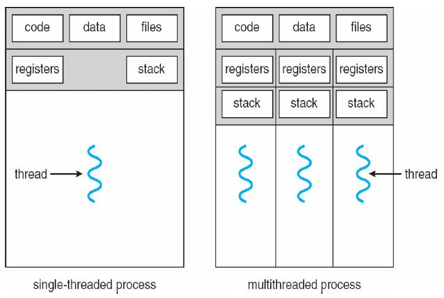

[zurück](README.md)

# 05: Threads

> 30.10.2017, 06.11.2017

## Table of Contents

- [What is a thread?](#what-is-a-thread)
    - [Why threads?](#why-threads)
        - [Example: word processor](#example-word-processor)
- [Pthreads](#pthreads)
    - [Pthread API basics](#pthread-api-basics)
    - [Mulithreaded programming is hard](#mulithreaded-programming-is-hard)
        - [Making singlethreaded code multithreaded](#making-singlethreaded-code-multithreaded)
- [Data structures](#data-structures)
    - [PCB and TCB](#pcb-and-tcb)
- [Thread models](#thread-models)
    - [Many-to-one model](#many-to-one-model)
        - [Pros of user level threads](#pros-of-user-level-threads)
        - [Cons of user level threads](#cons-of-user-level-threads)
        - [Implementation of user level threads](#implementation-of-user-level-threads)
        - [Address space layout with two user level threads](#address-space-layout-with-two-user-level-threads)
    - [One-to-one model](#one-to-one-model)
        - [Pros of kernel level threads](#pros-of-kernel-level-threads)
        - [Cons of kernel level threads](#cons-of-kernel-level-threads)
        - [Implementation of kernel level threads](#implementation-of-kernel-level-threads)
        - [Address space layout with two kernel levels threads](#address-space-layout-with-two-kernel-levels-threads)
    - [M-to-N model](#m-to-n-model)
        - [Pros of hybrid threads](#pros-of-hybrid-threads)
        - [Cons of hybrid threads](#cons-of-hybrid-threads)
        - [Implementation of hybrid threads](#implementation-of-hybrid-threads)

## What is a thread?

Traditionally, each process has it’s own address space, it’s own set of allocated resources and exactly one thread of execution.
Modern operating systems provide the option of having *multiple* **threads** per process.

*Note*: This does not always apply.
    Sometimes threads don’t share address spaces, and e.g. in Linux threads are regular processes with shared resources and address space.

Some data is **thread local**, some is **thread global** (but still **process local**).

### Why threads?

While processes share data explicity, threads usually work with common memory.
Hence, if activities share a lot of data, it’s often better to use a thread instead of a process.

#### Example: word processor

Activities may be:

- Accepting input
- Applying a lot of formatting
- Rendering output
- Reading and writing files

Those activities all operate on the same set of data.

## Pthreads

A **thread library** provides an API for creating and managing threads. **Pthreads** is a POSIX thread library (IEEE 1003.1c) common in UNIX systems.
The API defines more than 60 functions for dealing with threads.
Internals depend on the specific implementation.

### Pthread API basics

Each `Pthread` has

- a **thread identifier** (TID)
- a set of registers (at least IP and SP)
- a stack containing it's call history and thread local variables

Some basic Pthread functions are:

- `Pthread_create`: creates a new thread
- `Pthread_exit`: terminates the calling thread
- `Pthread_join`: waits for a specific thread to exit
- `Pthread_yield`: invoke thread library to choose another process

### Mulithreaded programming is hard

*Brace yourself*.
It doesn’t matter whether you’re using multiple processes, mulitple threads or both; you will need to take care of a lot more things compared to singlethreaded programming:

- Distributing and balancing activities
- Distributung data
- Synchronizing access to shared state

A rule of thumb: processes share less data than threads, so there is less that can go wrong.

#### Making singlethreaded code multithreaded

Not all state should be shared across threads.
E.g. `errno` contains the return value of the last syscall, but is thread-global.

A lot of library code is not **threadsafe**.
When working with multiple threads, you should generally use `_r` variants of functions, if available (e.g. `strtok_r`, `rand_r`).

## Data structures

Processes primarily hold resources; threads are states of exectution.
Those abstractions require different kinds of data.

### PCB and TCB

We differentiate between **process control block** (PCB) and **thread control block** (TCB).

A **PCB** may contain:

- address space
- opened files
- child processes
- pending alarms

A **TCB** may contain:

- registers (e.g. IP, SP)
- stack
    - local variables
    - function call history

*Note*: The OS always knows about all PCBs, but what TCBs it knows about depends on the **thread model**.

## Thread models

The OS always knows about at least one thread per process.
Threads that are known to the OS are called **kernel threads**, threads that are only known to their process are called **user threads**.

### Many-to-one model

The Kernel only manages processes, so multiple threads may be unknown to the kernel.
Threads are managed by a userspace library (e.g. GNU Portable Threads) and are called **user level threads**.

#### Pros of user level threads

- Very fast thread management
- Flexible scheduling policy
- Few system resources
- Usable even if the underlying OS does not support threads

#### Cons of user level threads

- No parallel execution (periodic context switching)
- If any user thread blocks, the whole process blocks
- Re-implementation of OS features (e.g. scheduler)

#### Implementation of user level threads

System V-like systems (e.g. Linux) define

- Types `mcontext_t` and `ucontext_t` for keeping thread state
- `makecontext`: initializes a new context
- `getcontext`: stores the current context
- `setcontext`: replaces the current context
- `swapcontext`: switches thread context on user level

Calls for managing threads can be easily be implemented in user space using these functions; e.g. `yield` saves context and replaces itself with a different context.

Periodic thread switching can be implemented using alarms.

#### Address space layout with two user level threads

The uppermost area of the AS is used by the thread library as its stack and is known to the kernel.
When an alarm is received (cheap version of **upcalls**, see below), this area is used.
The thread stacks are allocated on the process’ heap using malloc .

### One-to-one model

The kernel knows and manages every thread.
Every thread known to the user maps to one **kernel level thread** (KLT).
Windows XP/Vista/7, Linux, Solaris and OS X all support this.

#### Pros of kernel level threads

- Real parallelism possible
- Threads block individually

#### Cons of kernel level threads

- OS has to manage every active thread (TCB, stack, etc.)
- Syscalls needed for thread management
- Scheduling fixed in OS

#### Implementation of kernel level threads

In UNIX, **signals** are used to notify a process that a particular event has occurred.
For example, a process can ask the OS to send a `SIGALRM` after a specific time. **Signal handlers** can run

- on the process stack
- on a dedicated stack for this specific handler
- on a dedicated stack for all specific handler

However, there are some issues with kernel level threads:

- Whom is the `SIGALRM` delivered to (all threads in the process, a single one, etc.)?
- What happens when a process with multiple KLTs calls `fork`?

#### Address space layout with two kernel levels threads

Every thread gets its designated stack growing downwards.
The process heap is shared.

### M-to-N model

M user level threads are mapped to N kernel level threads, N ≤ M.
The goal of this **hybrid threads** model is to get the advantages of ULT and KLT — non-blocking threads combined with quick management.

To reach this goal, the kernel creates a “sufficient” number of KLTs. ULTs are flexibly allocated on those KLTs in user space.

This model supported in e.g. Solaris 9 and earlier, Windows NT/2000 with ThreadFiber and Linux 2.4.

#### Pros of hybrid threads

- Flexible scheduling policy
- Efficient and parallel execution

#### Cons of hybrid threads

- Hard to debug and implement 
    - non-blocking I/O
    - choosing the right “sufficient” number of KLTs

#### Implementation of hybrid threads

One of the goals here is not too call the kernel in thread management calls such aus `create` and `join`.
To accomplish this goal, multiple ULTs run on each KLT.
When a process blocks, the user space system switches context without calling the kernel.

The solution is to use so-called **upcalls**.
The kernel notices — by receiving a syscall — that a process will block and sends a signal to the process.
The exception handler of the process can then schedule another user level thread to run.
The kernel later informs the process that the action has finished via another upcall.
