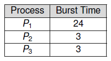

[zurück](README.md)

# 06: Dispatching, Scheduling, Scheduling Policies

> 07.11.2017

## Table of Contents

**TODO**

## Dispatching

The machine has `K` jobs ready to run, but only `N` CPUs with `K > N > 1`.

_Scheduling problem:_ Which jobs should be assigned to which CPUs?

### Which Jobs Should Be Assigned to Which CPU(s)?

The CPU _scheduler_ selects the next process to run using a specific _policy_.

The _dispatcher_ performs the actual process switch, including:

- saving and restoring process contexts
- switching to user mode

### Voluntary Yielding vs Preemption

The kernel is responsible for performing the CPU switch:

**Voluntary Yielding:**  
Due to the fact that the kernel isn't always running, it cannot dispatch a different process unless it is invoked!  
The kernel can switch at any system call, however using _cooperative multitasking_, the currently running process performs a `yield` system call to ask the kernel to switch to another process.

**Preemption:**  
The kernel often wants to preempt the currently running process to schedule a different process. This requires the kernel to be invoked in certain time intervals. Usually, _timer interrupts_ are used as a trigger to make scheduling decisions after every "time-slice".

### CPU Switch from Process to Process

## Scheduling

### Process State

A process can be in different states:
- **new:** has been created but never ran
- **running:** instructions are currently executed
- **waiting:** waiting for some event to occur
- **ready:** waiting to be assigned to a CPU
- **terminated:** finished execution (zombie state)

### Types of Schedulers

**Short-term scheduler:** (_CPU scheduler_)  
- selects next process to be executed and allocates a CPU
- invoked very frequently (milliseconds), therefore must be fast

**Long-term scheduler:** (_job scheduler_)  
- selects processes to be added into the ready queue
- invoked infrequently (seconds, minutes), there can be slow
- controls the degree of multiprogramming

_The lecture will focus on CPU schedulers (short term)._

### Process Scheduling Queues

**Job queue:** Set of _all_ processes in the system  
**Ready queue:** Processes in _ready_ or _waiting_ state  
**Device queue:** Processes waiting for an I/O device

## Scheduling Policies

Some common scheduling policies for different environments. While all policies try to be as _fair_ as possible to processes and _balance_ all system parts, there are different **goals** for every category:

- **Batch Scheduling**
    - still widespread in business applications (payroll, inventory, ...)
    - non-preemptive algorithms are acceptable (-> less switches -> less overhead)
    - **Throughput:** # of processes that complete per time unit
    - **Turnaround Time:** time from submission to completion of a job
    - **CPU Utilization:** keep the CPU(s) as busy as possible
- **Interactive Scheduling**
    - preemption essential to keep processes from hogging CPU time
    - **Waiting Time:** time each process waits in ready queue
    - **Response Time:** Time from request to first response
- **Real-Time Scheduling**
    - garantueed completion of jobs within time constraints
    - preemption is not always needed
    - **Meeting Deadlines:** finish jobs in time
    - **Predictability:** minimize jitter

### First-Come, First-Served (FCFS) Scheduling

Suppose 3 processes arrived in order: P1, P2, P3

_Gantt_ chart:  

Turnaround times: `P1 = 24, P2 = 27, P3 = 30`  
Average: `(24 + 27 + 30) / 3 = 27` -> **Can we do better?**

---

Now suppose the 3 processes arrived in order P2, P3, P1

_Gantt_ chart:  

Turnaround times: `P1 = 30, P2 = 3, P3 = 6`  
Average: `(30 + 3 + 6) / 3 = 13` -> **Much better than previously!**

Good scheduling can ~~save lives~~ reduce turnaround time!

### Shortest-Job-First (SJF) Scheduling

The FCFS (First-Come First-Served Scheduling) is prone to the _Convoy effect_. All short (_"fast"_) jobs have to wait for long (_"slow"_) jobs that arrived previously.  
**Idea:** Run shortest job first.

SJF has optimal average turnaround, waiting and response times, however the scheduler cannot know job length in advance.  
**Solution:** Predict length of next CPU burst for each process, then schedule the process with the shortest burst next.

#### Estimating the Length of Next CPU Burst

Idea: use exponential averaging based on previous CPU bursts  
`t(n)` = actual length of n-th CPU burst  
`τ(n+1)` = predicted value for the next CPU burst  
Define `τ(n+1) = α*t(n) + (1 - α)*τ(n)` with `0 <= α <= 1`

Example with `α = 0.5`:  

#### CPU vs. I/O Burst Cycles

Why do CPU bursts exist? Because the CPU bursts, then waits for I/O.

#### Process Behavior: Boundedness

Processes can be characterized as either:
- **CPU-bound processes:** more time spent doing computations (very long but few CPU bursts)
or
- **I/O-bound processes:** more time spent doing I/O (many short CPU bursts)

### Preemptive Shortest-Job-First (PSJF) Scheduling

SJF (_shortest-job-first_) scheduling optimizes waiting and response time, but what about throughput?  
CPU bound jobs hold the CPU until end of execution of I/O events, that means poor I/O utilization.

**Idea:** use SJF (_shortest-job-first_) scheduling, but periodically preempt to make a new scheduling decision (choose job with shortest remaining time).

  

### Round Robin (RR) Scheduling

Each process runs for a small unit of CPU time.
The length of those **time quantums**/**slice lengths** are usually around 10 to 100 milliseconds. 
Processes are interrupted at the end of their time slice and inserted at the end of the run queue.
After a process has been interrupted, the first process from the run queue is run.

The time slice each process gets needs to create a balance between interactivity and overhead, since interrupting and dispatching new processes takes additional time.

- If the time slice is much larger than dispatch time, the overhead is acceptable
- If the time slice is about the same as the dispatch time, about 50% of CPU time is wasted for switching between processes

Gantt chart for processes P1, P2 and P3 of the lengths 3, 3 and 24:

Typically, round robin has has a higher average turnaround than SJF, but better response time and a good average waiting time when job lengths vary.

### Virtual Round Robin (RR) Scheduling

Round robin is unfair for I/O bound jobs because they often block before using up their time quantum.
CPU-bound jobs can use up their entire slice &mdash; using the same number of slices, CPU-bound jobs get more CPU time.
**Virtual round robin** puts jobs that didn&rsquo;t use up their time slice into an additional queue.
Time that hasnt been used gets stored with the processes.
Jobs in the additional queue are assigned a higher priority than normal jobs.
After they have been run completely, they are put back in the normal queue.

### (Strict) Priority Scheduling

Each process is assigned an integer priority number.
For each of those numbers, there is a queue.
Allocate CPU time via round robin; start at the first queue (highest priority) and only execute jobs of lower priorities if there are no more important jobs (**strict priority scheduling**).

This way, it is possible that some processes never run, because they&rsquo;re not important enough (**starvation**).
To counter this phenomenon, **aging** can be employed, i.e. processes move to a higher priority after waiting a while.

### Multi-Level Feedback Queue (MLFB) Scheduling

In order to get a good trade-off between interactivity and overhead, this policy aims to give I/O-bound jobs a higher priority, but also runs them for smaller time slices, while giving CPU-bound jobs a lower priority, running them for a longer time.

The approach here is to use different queues that have different priorities *and* different time slices.
E.g. one might assign the priority 2n to each queue where n is the queues priority (lower n means higher priority).
In order to keep the balance, move processes that do not use up their time slice repeatedly to a higher priority and move those that do use up their slices repeatedly to a lower priority.

### Priority Donation

Some times, a process B may wait for a process A.
If A now has a lower priority than B, B effectively has a lower priority too.

A solution to this problem may be the so-called **priority donation**/**priority inheritance**; give process A the same priority as process B as long as B waits for A.
But what if now processes C and D also wait for B?
Should priorities be donated transitively?
The proposed solution is to give A only the highest priority of B, C and D.

### Lottery Scheduling

Issue a total number n of **lottery tickets** to processes.
The higher the priority of a process is, the more tickets it gets.

Now for each time slice, generate a random number 0 ≤ r < n.
Traverse the list of all processes, and give the slice to the first process where sum of ticket numbers is bigger than r.

Processes may transfer tickets to other processes while waiting for them.
**Ticket donation** usually works better than priority donation.

## Linux scheduler

The Linux scheduler aims to be “one scheduler to rule them all”.
Its goals are:

- Fairness
- Low task response time for I/O-bound (interactive) processes
- High throughput for CPU-bound tasks
- Low overhead
- Time slice size based on priority
- Suitability for multiprocessors 

### O(1) scheduler

Until 2007 the Linux kernel used a so-called O(1) scheduler.
It completed scheduling tasks in constant time complexity.
It featured:

- 140 different priorities
    - 0 through 99 for realtime tasks
    - 100 through 140 for user tasks (default class 120, niceness ranging from -20 to 19)
- Two run-queue entries per priority per CPU
    - Linked list of active processes
    - Linked list of expired processes
- Bitmap (140 bit) for efficiently finding an empty priority

#### How the O(1) scheduler works

When scheduling a new process and an empty priority has been found, run the first process from the list of active processes.
After its time slice has expired, remove it from the active list and add it to the expired list.
If the active list is empty, replace it by the expired list and replace the expired list by an empty list.

After a process becomes runnable, it is added to the active list of the chosen priority and the corresponding bit in the priority bitmask is set (marks the priority as non-empty).

After a process becomes not runnable, it is removed from the runqueue of is priority and the corresponding bit is cleared if there are no other processes in the same priority.

#### Problems of the O(1) scheduler

Some processes have a static priority (can be set by `nice`) from -20 to 19, but others have their priority assigned dynamically.
CPU-bound processes should get a penalty while I/O-bound processes should be rewarded.

The main issue with the O(1) scheduler was the use of complex heuristics to determine the penalty/reward for processes.

### Completely fair scheduler

Since 2007, the Linux kernel provides multiple scheduling classes with their own scheduling policies.
Scheduling classes implement a common API:

- Enqeue task
- Dequeue task
- Pick next task

#### Scheduling classes and policies

- Stop (no policies)
- Deadline (SCHED_DEADLINE)
- Realtime (SCHED_FIFO, SCHED_RR)
- Completely fair (SCHED_NORMAL, SCHED_BATCH, SCHED_IDLE)
- Idle (no policies)

#### Stop

