[zurück](README.md)

# 06: Dispatching, scheduling, scheduling policies

> 07.11.2017, 13.11.2017

## Table of contents

> TODO

## Dispatching

The machine has `k` jobs ready to run, but only `n` CPUs where `k > n` and `n > 1`.

The **scheduling problem** is described by the following question: Which jobs should be assigned to which CPUs?

### Which jobs should be assigned to which CPU(s)?

The CPU **scheduler** selects the next process to run using a specific **policy**.
The **dispatcher** performs the actual process switch, including:

- saving and restoring process contexts
- switching to user mode

### Voluntary yielding vs. preemption

The kernel is responsible for performing the CPU switch:

#### Voluntary yielding

Due to the fact that the kernel is not always running, it cannot dispatch a different process unless it is invoked.
The kernel can switch at any system call, however, using **cooperative multitasking**, the currently running process performs a `yield` system call to ask the kernel to switch to another process.

#### Preemption

The kernel often wants to preempt the currently running process to schedule a different process. This requires the kernel to be invoked in certain time intervals. Usually, **timer interrupts** are used as a trigger to make scheduling decisions after every **time slice**.

### CPU switch from process to process, graphically

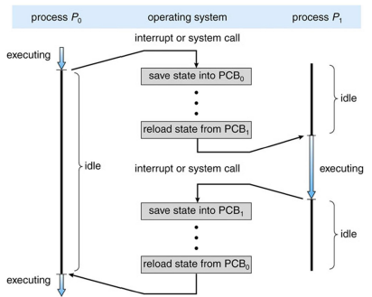

## Scheduling

### Process states

A process can have _one_ of the following states at once:

- **new**: has been created but never ran
- **running**: instructions are currently executed
- **waiting**: waiting for some event to occur
- **ready**: waiting to be assigned to a CPU
- **terminated**: finished execution (**zombie** state)

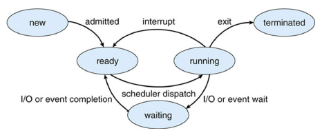

### Types of schedulers

#### Short-term scheduler (CPU scheduler)

- selects next process to be executed and allocates a CPU
- invoked very frequently (milliseconds), therefore must be fast

#### Long-term scheduler (job scheduler)

- selects processes to be added into the ready queue
- invoked infrequently (seconds, minutes), therefore can be slow
- controls the degree of multiprogramming

This lecture will focus on CPU schedulers.

### Process scheduling queues

- **Job queue**: Set of _all_ processes in the system
- **Ready queue**: Processes in **ready** or **waiting ** state
- **Device queue**: Processes waiting for an I/O device

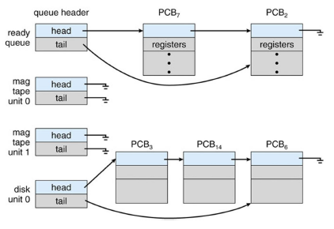

## Scheduling policies

We will now take a look at some common scheduling policies for different environments.
While all policies try to be as **fair** as possible to processes and balance all system parts, there are different goals for each category:

- **Batch scheduling**
    - still widespread in business applications (payroll, inventory, ...)
    - non-preemptive algorithms are acceptable (less switches, less overhead)
    - **Throughput**: number of processes that complete per time unit
    - **Turnaround time**: time from submission to completion of a job
    - **CPU utilization**: keeping the CPU(s) as busy as possible
- **Interactive scheduling**
    - preemption essential to keep processes from hogging CPU time
    - **Waiting time**: time each process waits in ready queue
    - **Response time**: time from request to first response
- **Real-time scheduling**
    - garantueed completion of jobs within time constraints
    - preemption is not always needed
    - **Meeting deadlines**: finish jobs in time
    - **Predictability**: minimize jitter

### First-come, first-served (FCFS) scheduling

Suppose 3 processes `P1`, `P2` and `P3` arrived in the following order:

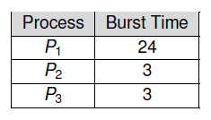

Using FCFS scheduling, they would just be executed in this order.
Corresponding **Gantt chart**:

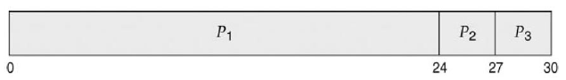

Turnaround times: `P1 = 24`, `P2 = 27`, `P3 = 30`.  
Average: `(24 + 27 + 30) / 3 = 27`.

Can we do better?
Now suppose the 3 processes arrived in order `P2`, `P3`, `P1`.
The Gantt chart would look like this:

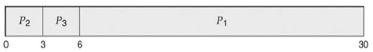

Turnaround times: `P1 = 30`, `P2 = 3`, `P3 = 6`.  
Average: `(30 + 3 + 6) / 3 = 13`, much better than before.

Good scheduling can _drastically_ reduce turnaround time.

### Shortest-job-first (SJF) scheduling

FCFS scheduling is prone to the **convoy effect**.
All short (fast) jobs have to wait for long (slow) jobs that arrived previously.

Idea: just run the shortest job first.

SJF has optimal average turnaround, waiting and response times, however the scheduler cannot know job length in advance.
The scheduler tries to predict the length of next CPU burst for each process, then schedules the process with the shortest burst next.

#### Estimating the length of next CPU burst

Idea: use exponential averaging based on previous CPU bursts.

In the following formula, `t(n)` describes the actual length of the n-th CPU burst, `a` is some constant between 0 and 1, and `t'(n + 1)` describes a prediction of length of the next CPU burst.

```
t'(n + 1) = a * t(n) + (1 - a) * t'(n)
```

Example where `a = 0.5`:

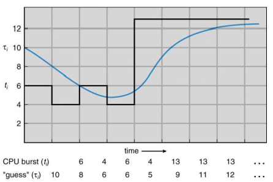

#### CPU vs. I/O burst cycles

Why do CPU bursts exist?
Because the CPU bursts, then waits for I/O.

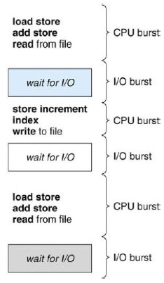

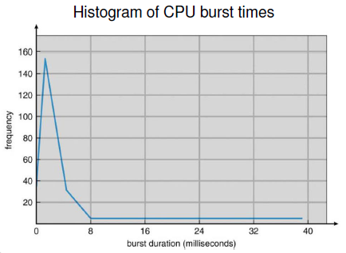

#### Boundedness

Processes can be characterized as either:

- **CPU-bound**: more time spent doing computations (very long but few CPU bursts)
- **I/O-bound**: more time spent doing I/O (many short CPU bursts)

### Preemptive shortest-job-first (PSJF) scheduling

SJF scheduling optimizes waiting and response time, but what about throughput?
CPU-bound jobs block the CPU until end of execution of I/O events, that means poor I/O utilization.

Idea: use SJF scheduling, but periodically preempt to make a new scheduling decision (choose job with shortest remaining time).

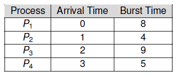

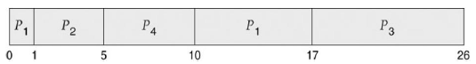

### Round robin (RR) scheduling

Each process runs for a small unit of CPU time.
The length of those **time quantums**/**slice lengths** are usually around 10 to 100 milliseconds.
Processes are interrupted at the end of their time slice and inserted at the end of the run queue.
After a process has been interrupted, the first process from the run queue is run.

The time slice each process gets needs to create a balance between interactivity and overhead, since interrupting and dispatching new processes takes additional time.

- If the time slice is much larger than dispatch time, the overhead is acceptable
- If the time slice is about the same as the dispatch time, about 50% of CPU time is wasted for switching between processes

Gantt chart for processes `P1 = 3`, `P2 = 3` and `P3 = 24`.

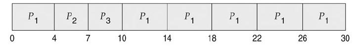

Typically, round robin has has a higher average turnaround than SJF, but better response time and a good average waiting time when job lengths vary.

### Virtual round robin (RR) scheduling

Round robin is unfair for I/O bound jobs because they often block before using up their time quantum.
CPU-bound jobs can use up their entire slice — using the same number of slices, CPU-bound jobs get more CPU time.


**Virtual round robin** puts jobs that did not use up their time slice into an additional queue.
Time that hasnt been used gets stored with the processes.
Jobs in the additional queue are assigned a higher priority than normal jobs.
After they have been run completely, they are put back in the normal queue.

### (Strict) priority scheduling

Each process is assigned an integer priority number.
For each of those numbers, there is a queue.
Allocate CPU time via round robin; start at the first queue (highest priority) and only execute jobs of lower priorities if there are no more important jobs (**strict priority scheduling**).

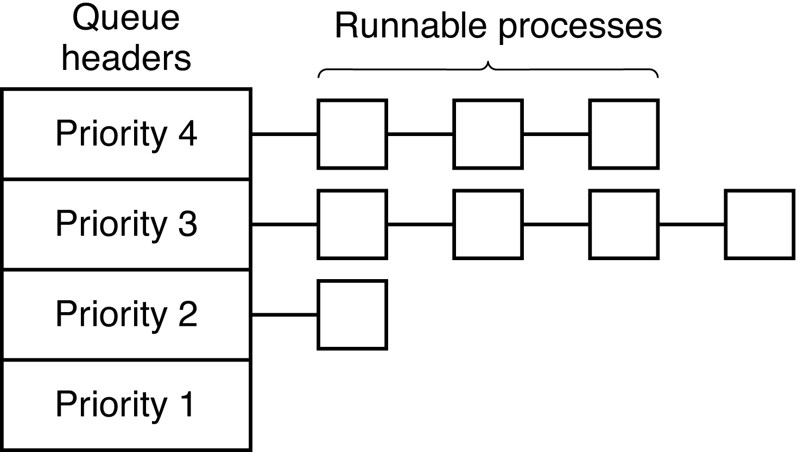

This way, it is possible that some processes never run, because their priority is too low (**starvation**).
To counter this phenomenon, **ageing** can be employed, i.e. processes move to a higher priority after waiting a while.

### Multi-level feedback queue (MLFB) scheduling

In order to get a good trade-off between interactivity and overhead, this policy aims to give I/O-bound jobs a higher priority, but also runs them for smaller time slices, while giving CPU-bound jobs a lower priority, running them for a longer time.

The approach here is to use different queues that have different priorities *and* different time slices.
E.g. one might assign the priority `2 ** n` to each queue where n is the queues priority (lower `n` means higher priority).
In order to keep the balance, move processes that do not use up their time slice repeatedly to a higher priority and move those that do use up their slices repeatedly to a lower priority.

#### Priority donation

Some times, a process B may wait for a process A.
If A now has a lower priority than B, B effectively has a lower priority too.

A solution to this problem may be the so-called **priority donation**/**priority inheritance**; give process A the same priority as process B as long as B waits for A.
But what if now processes C and D also wait for B?
Should priorities be donated transitively?
The proposed solution is to give A only the highest priority of B, C and D.

### Lottery scheduling

Issue a total number n of **lottery tickets** to processes.
The higher the priority of a process is, the more tickets it gets.

Now for each time slice, generate a random number `r` where `0 <= r` and `r < n`.
Traverse the list of all processes, and give the slice to the first process where sum of ticket numbers is bigger than r.

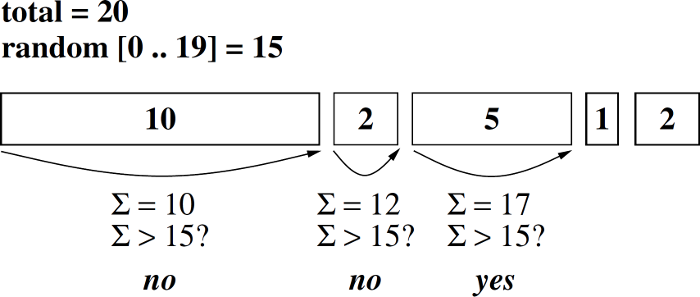

Processes may transfer tickets to other processes while waiting for them.
**Ticket donation** usually works better than priority donation.

## Linux scheduler

The Linux scheduler aims to be “one scheduler to rule them all”, since Linux is used on a lot of different platforms — servers, desktop PCs, notebooks, phones, embedded systems etc.
Its goals are:

- Fairness
- Low task response time for I/O-bound (interactive) processes
- High throughput for CPU-bound tasks
- Low overhead
- Time slice size based on priority
- Suitability for multiprocessors 

### O(1) scheduler

Until 2007 the Linux kernel used a so-called O(1) scheduler.
It completed scheduling tasks in constant time complexity.
It featured:

- 140 different priorities
    - 0 through 99 for realtime tasks
    - 100 through 140 for user tasks (default class 120, niceness ranging from -20 to 19)
- Two run-queue entries per priority per CPU
    - Linked list of active processes
    - Linked list of expired processes
- Bitmap (140 bit) for efficiently finding an empty priority

#### How the O(1) scheduler works

When scheduling a new process and an empty priority has been found, run the first process from the list of active processes.
After its time slice has expired, remove it from the active list and add it to the expired list.
If the active list is empty, replace it by the expired list and replace the expired list by an empty list.

After a process becomes runnable, it is added to the active list of the chosen priority and the corresponding bit in the priority bitmask is set (marks the priority as non-empty).

After a process becomes not runnable, it is removed from the runqueue of is priority and the corresponding bit is cleared if there are no other processes in the same priority.

#### Problems of the O(1) scheduler

Some processes have a static priority (can be set by `nice`) from -20 to 19, but others have their priority assigned dynamically.
CPU-bound processes should get a penalty while I/O-bound processes should be rewarded.

The main issue with the O(1) scheduler was the use of complex heuristics to determine the penalty/reward for processes.

### Completely fair scheduler

Since 2007, the Linux kernel provides multiple scheduling classes with their own scheduling policies.
Scheduling classes implement a common API:

- Enqeue task
- Dequeue task
- Pick next task

There are five scheduling classes (scheduling policies in parentheses):

- Stop (no policies)
- Deadline (SCHED_DEADLINE)
- Realtime (SCHED_FIFO, SCHED_RR)
- Completely fair (SCHED_NORMAL, SCHED_BATCH, SCHED_IDLE)
- Idle (no policies)

#### Stop class

The stop class has the highest priority and is only used when multiple CPUs (cores) exist.
It is used for moving jobs between CPUs, CPU hotplugging and the like.
There is usually only one stop job per CPU.

#### Deadline class

Deadline jobs have the highest priority after stop jobs.
They are based of **earliest deadline first** scheduling.
That means:

- Tasks can declare their required runtime
- They can run for an assigned time budget but will be suspended as soon as that budget is used

They can be used for period realtime tasks — i.e. tasks that may be buffered, for example video encoding or decoding.

#### Realtime class

Realtime jobs are **POSIX real-time tasks**.
They are assigned a priority ranging from 0 to 99 and there are two possible policies; SCHED_FIFO and SCHED_RR (round robin with a default time slice of 100 milliseconds).
To run a realtime job on a Linux machine, execute the following (requires root privileges):

```
$ chrt --rr <priority> <task>
```

#### CFS class

CFS stands for **completely fair scheduler**.
It features the scheduling policies SCHED_NORMAL for normal Unix tasks, SCHED_BATCH for non-interactive batch jobs and SCHED_IDLE for low priority tasks.
It tracks the virtual runtime (**vruntime**, time spent on CPU) of each task.
The priority of a task defines its weight in the vruntime calculation; the higher a tasks weight, the slower its vruntime increases.
The task with the shortest vruntime value runs first.

CFS uses a self-balancing red-black tree containing all tasks internally, indexed by the jobs vruntime.
It may be described as representing a timeline of future process executions.
IO-bound tasks (low vruntime) get a higher priority in this model, CPU-bound jobs do not get more CPU time.

#### Idle class

Idle jobs are of the lowest scheduling priority.
Each CPU has exaclty one idle thread that only runs when nothing else is runnable.
It may take the CPU to a lower power state in order to save energy.

### SMP scheduling in the Linux kernel

Each core gets their own runqueue.
Runqueues are not synchronized across cores for efficiency reasons.
This means that some cores may be idle although others have jobs waiting.
Jobs are periodically migrated to cores with empty queues.
To avoid race conditions, runqueues need to be locked.
