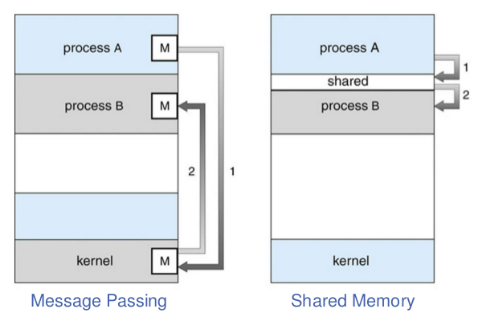

[zurück](README.md)

# 07: Inter Process Communication

> 14.11.2017

## Table of Contents

- [Inter Process Communication (IPC)](#inter-process-communication-ipc)
    - [Message passing](#message-passing)
        - [Direct vs. indirect messages](#direct-vs-indirect-messages)
        - [Sender/receiver synchronization](#senderreceiver-synchronization)
        - [Buffering](#buffering)
        - [Example: message boxes in mach (e.g. Max OS X)](#example-message-boxes-in-mach-eg-max-os-x)
        - [Example: POSIX message queues](#example-posix-message-queues)
    - [Shared memory](#shared-memory)
        - [Example: POSIX shared memory](#example-posix-shared-memory)
        - [Sequential memory consistency](#sequential-memory-consistency)
        - [Memory consistency model](#memory-consistency-model)
        - [x86 memory consistency](#x86-memory-consistency)
- [Synchronization](#synchronization)
    - [Race conditions](#race-conditions)
    - [Critical section](#critical-section)
    - [Busy waiting](#busy-waiting)
        - [Disabling interrupts](#disabling-interrupts)
        - [Lock variables](#lock-variables)
        - [Atomic operations](#atomic-operations)
        - [Spinlock limitations](#spinlock-limitations)
    - [Semaphore](#semaphore)
        - [Implementation considerations](#implementation-considerations)
        - [Fast user space mutex (futex)](#fast-user-space-mutex-futex)

## Inter Process Communication (IPC)

Processes and threads need to communicate with one another, reasons for that are e.g. information sharing, computation speed-up and modularity.

- **Interprocess Communication** (IPC) allows exchanging data using two different methods:
- **Message passing** using system calls to explicitly send and receive information (e.g. pipes, sockets)
- **Shared memory** establishes a physical memory region that multiple processes/threads can read and write to (e.g. shared memory-mapped files)



### Message passing

Message passing is a mechanism for processes to communicate and synchronize their actions using `send` and `receive` operations.

An implementation of this communication link is based on the hardware bus, shared memory, kernel memory and the network interface card (NIC).

#### Direct vs. indirect messages

In **direct messages**, processes name each other explicitly, e.g.

- `send(P, message)` sends a message to process `P`
- `receive(Q, message)` receives a message from process `Q`

**Indirect messages** use a **mailbox** system instead. Each mailbox has a unique id, a mailbox is automaticly created together with the first communicating process and destroyed with the last one. However this model requires a shared mailbox between the communicating processes.

Problems using mailboxes:  
Assume `P1`, `P2` and `P3` share a mailbox and `P1` sends a message which is received by `P2` and `P3`.

- Who gets the message?
- Allow a link to be associated with at most two processes?
- Allow only one process at a time to execute a receive operation?
- Allow the system to arbitrarily select the receiver?

#### Sender/receiver synchronization

Message passing may be either **blocking** or **non-blocking**.

**Blocking** is considered _synchronous_:
- Blocking `send` blocks the sender until message was received
- Blocking `receive` blocks the receiver until a message is available

**Non-blocking** is considered _asynchronous_:
- Non-blocking `send` sends the message and continues
- Non-blocking `receive` will receive a valid message or `null`

The question whether non-blocking senders can communicate with non-blocking receivers depends on the **buffering scheme**.

#### Buffering

Messages are queued using different capacities:

- Zero capacity - no queuing
    - Sender must wait for receiver (rendezvous)
    - Message is tranferred a soon as receiver becomes available
- Bounded capacity - finite number and length of messages
    - Sender can send before receiver expects a message
    - Sender can send while receiver still busy (e.g. with previous message)
    - Sender must wait if link full
- Unbounded capacity
    - Sender never waits
    - Potential memory overflow
    - Possibly large latency between `send` and `receive`

#### Example: message boxes in mach<sup>1</sup> (e.g. Max OS X)

All communication is based on messages (even system calls). Every task gets two initial mailboxes (**ports**) on creation: _Kernel_ and _Notify_, further mailboxes can be allocated for process-to-process communication using `port_allocate()`.

`msg_send`, `msg_receive` and `msg_rpc` are used for messaging while _blocking_, _time-out_ and _non-blocking_ synchronizations with a max buffer capacity of 65536 messages are available.

Every port is owned by a single process which is allowed to receive messages, **Mailbox-Sets** allow receiving messages from multiple mailboxes.

<sup>1</sup>: https://en.wikipedia.org/wiki/Mach_%28kernel%29

#### Example: POSIX message queues

- Creation or opening of an existing message queue:  
`mqd_t mq_open(const char *name, int oflag);`
- Send a message to the queue:  
`int mq_send(mqd_t md, const char *msg, size_t len, unsigned priority);`
- Receive message with the hightest priority:  
`int mq_receive(mqd_t md, char *msg, size_t len, unsigned *priority);`
- Register a callback handler on message queue to avoid polling:  
`int mq_notify(mqd_t md, const struct sigevent *sevp);`
- Remove message queue:  
`int mq_unlink(const char *name);`

### Shared memory

Interprocess communication using shared memory works by creating a region in memory that can be access by multiple processes. Every write operation is visible to the other processes, the hardware guarantees that read operations will always return the most recent write.

Using shared memory in a safe way (and high performace) is tricky due to the **cache coherency protcol** if many processes and many CPUs are involved and **race conditions** if there are multiple writers.

#### Example: POSIX shared memory

- Open or create a new POSIX shared memory object (returns handle):  
`int shm_open(const char *name, int oflag, mode_t mode);`
- Set size of shared memory region:  
`ftruncate(smd, size_t len);`
- Map shared memory object to address space:  
`void * mmap(void *addr, size_t len, […], smd, […]);`
- Unmap shared memory object from address space:  
`int munmap(void *addr, size_t len);`
- Destroy shared memory object:  
`int shm_unlink(const char *name);`

#### Sequential memory consistency

**Sequential consistency (SC)**:
> The result of execution is as if all operations were executed in some sequential order, and the operations of each processor occured in the order specified by the program. (Lamport)

When communicating via shared memory, we tend to assume sequential consistency. However in reality, the compiler and the CPU re-order instructions to **execution order** for more efficiency. Without sequential consistency, multiple processes on multiple cores behave worse than preemptive threads on a single core.

#### Memory consistency model

CPUs a generally **not** sequentially consistent because it would…

- …complicate write buffers
- …complicate non-blocking reads
- …make cache coherence more expensive

Compilers also do not generate code in program order because they e.g. re-arrange loops for better performance and perform common subexpression elimination.

As long as a single thread accesses a memory location at a time, this is not a problem. But **don’t try to access the same memory location with multiple threads at the same time without proper synchronization!**

#### x86 memory consistency

x86 includes multiple consistency and caching models, including **memory type range registers** (MTRR) for specifying consistent ranges of physical memory and **page attribute table** (PAT) for control on 4k page granularity.

The caching model and memory consistency are strongly tied together, e.g. certain store instructions such as `movnt` bypass the cache and can be re-ordered with other writes that go through the cache.

A `lock` prefix makes memory instructions _atomic_, meaning that they are totally ordered and cannot be re-ordered with non-locked instructions. (The `xchg` instruction is always locked, although it doesn’t wear the prefix.)  
Special `fence` instructions prevent re-ordering:

- `lfence` can’t be re-ordered with reads
- `sfence` can’t be re-ordered with writes
- `mfence` can’t be re-ordered with reads or writes

## Synchronization

### Race conditions

Assume the following two code fragments running in two different threads:

Thread 1: `count++;`  
Thread 2: `count--;`

After both threads finish their execution, `count` should still have the same value as before, right? What could possibly go wrong?

Thread 1 instructions:
```assembly
mov A count
add A 1
mov count A
```

Thread 2 instructions:
```assembly
mov A count
sub A 1
mov count A
```

Possible execution order:
```assembly
mov A count
sub A 1
mov A count
add A 1
mov count A
mov count A
```

Both threads have private registers, so `A` isn’t a problem here. However `count` is now `1` instead of the expected `0`. This is what we call a **race condition**.

x86 allows the single instruction `add count 1`, however the same problem still exists. Only so called _interlocked operations_ will save the day, but they are more expensive than regular operations and your compiler will not generate them on its own when using `count++`.

The idea: place `count++` and `count--` inside of a critical section `cs`:  
Thread 1
```c
enter_critical_section(&cs);
count++;
leave_critical_section(&cs);
```

Thread 2
```c
enter_critical_section(&cs);
count--;
leave_critical_section(&cs);
```

### Critical section

We want our **critical section** to support:

- **Mutual exclusion**: only one thread is allowed to be in the critical section at any time
- **Progress**: No thread outside of the CS is allowed to block other threads from getting inside the CS
- **Bounded waiting**: once a thread starts trying to enter the CS, there is a bound on the number of times other threads get in

### Busy waiting

#### Disabling interrupts

The kernel only switches threads on interrupts (usually on **timer interrupts**), therefore we could use a per-thread “do not interrupt” (DNI) bit to prevent interrupts when in a critical section.

Implementation on a _single-core system_ is easy:
- `enter_critical_section()` sets the DNI bit,
- `leave_critical_section()` clears the DNI bit

When DNI is set, interrupts never happen and therefore the scheduler is never called.

**Pro**:
- easy and convenient in the kernel

**Contra**:
- only works on single-core machines, disabling interrupts on one CPU doesn’t affect other CPUs
- we don’t really want to give users power to turn off interrupts, what if they are never turned on again?

#### Lock variables

Instead of disabling interrupts, let’s use a global variable `lock`:

- only enter critical section if `lock` is 0, set it to 1 then entering
- wait for lock to become 0 if wanted to enter critical section (called _busy waiting_)

```c
void enter_critical_section(volatile bool *lock)
{
    while (*lock != 0)
        ; // wait and do nothing

    *lock = 1;
}

void leave_critical_section(volatile bool *lock)
{
    *lock = 0;
}
```

Is the critical section problem solved now?  
**No!** The same problem still exists, because reading and setting `lock` is not atomic!

#### Atomic operations

To make the lock variables approach work, we need a way to read and set the lock variable at the same time.

In x86, `XCHG` can atomically exchange memory content with a register. Lets assume this C interface for `xchg`:  
`bool xchg(volatile bool *lock, register bool A);`  
It’ll exchange register content with memory content while returning the previous memory content of our lock.

Implementation of our lock using `xchg`, a so called _spinlock_:
```c
void enter_critical_section(volatile bool *lock)
{
    while (xchg(lock, 1) == 1) // lock = 1 and return old value
        ;                      // repeat until old value is not 1
}

void leave_critical_section(volatile bool *lock)
{
    *lock = 0;
}
```

Most modern CPUs provide atomic **spinlock** instructions with such semantics:
- test memory word and set value (TAS) (e.g. LDSTUB on SPARC V9)
- fetch and add (e.g. XADD on x86)
- exchange contents of two memory words (SWAP, XCHG)
- compare and swap (e.g. CAS on SPARC V9 and Motorola 68k)
- compare and exchange (e.g. CMPXCHG on x86)
- load-link/store-conditional (LL/SC) (e.g. ARM, PowerPC, MIPS)

Is the critical section problem solved now?  
- [x] **Mutual exclusion**
- [x] **Progress**
- [ ] **Bounded waiting**

#### Spinlock limitations

- Spinlocks don’t work very well **if the lock is congested**: they are easy and efficient if there is no thread in the CS while another one tries to enter it most of the time. However if the CS is large or many threads try to enter it, spinlocks may not be the best choice because all threads are activly wait spinning.
- Spinlocks don’t work very well **if threads on different cores use the same lock**: the memory address is written at every atomic swap operation, therefore memory is coherent between cores which is very expensive
- Spinlocks **can behave unexpectedly when processes are scheduled with static priorities** (such as **priority inversion**): if a thread with low priority holds a lock it will never able to release it, because it will never be scheduled

Nevertheless, spinlocks are wildly used, especially in kernels!

As it turns out, **busy waiting** is a big spinlock limitation. It wastes resources when threads are waiting for locks, it stresses the cache coherence protocol when used across cores and it can cause the priority inversion problem.  
There is a big room for improvements, e.g. put threads to sleep when waiting for locks and wake them up one at a time when a lock becomes free.

### Semaphore

We’ll introduce two syscalls that operate on integer variables which we call **semaphore** in this context:  
- `wait(&s)`: if `s > 0`: `s--` and continue, otherwise let caller sleep
- `signal(&s)`: if no thread waiting: `s++`, otherwise wake up one

`wait` corresponds to `enter_critical_section`, while `signal` corresponds to `leave_critical_secion`. Initialize `s` to the maximum number of threads that may enter the critical section at any given time.  
A semaphore initialized with 1 is called **binary semaphore**, **mutex semaphore** or just **mutex**. A semaphore with more that one thread allowed in the critical section at a time is called **counting semaphore**.

#### Implementation considerations

`wait` and `signal` need to be carefully synchronized, otherwise using semaphores could result in a **race condition** between checking and decrementing `s`. Also, **signal loss** could occur when waiting and waking threads up at the same time:

- consider a thread T1 checking `s`, which is 0
- before the thread goes to sleep, another thread T2 within the critical section finished
- T2’s `signal` doesn’t wake up any threads, as no thread is sleeping
- after Ts’s `signal` call finishes, T1 continues and begins sleeping

Now, one thread less than expected can enter the critical section. If no other thread comes along, T1 will sleep forever.

Each semaphore is associated with a wake-up queue:
- **weak semaphores** wake up a random waiting thread on `signal`
- **strong semaphores** wake up threads strictly in the order in which they started waiting

Is the critical section problem solved now?  
- [x] **Mutual exclusion**
- [x] **Progress**
- [x] **Bounded waiting**

Every `enter_critical_section()` and `leave_critical_section()` is a syscall now which are way slower than function calls. Can we do better?

#### Fast user space mutex (futex)

- Spinlocks:
    - Pro: quick when wait-time is short
    - Contra: waste resources when wait-time is long
- Semaphores:
    - Pro: efficient when wait-time is long
    - Contra: syscall overhead at every operation
- Idea of Linux’ **fast user space mutex** (futex):
    - there is a user space and kernel component
    - try to get into the critical section with a userspace spinlock
    - if the critical section is busy, use a syscall to put thread to sleep
    - otherwise, just enter the critical section with the now locked spinlock completely in userspace
