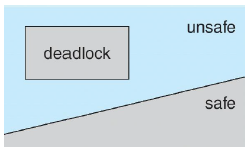
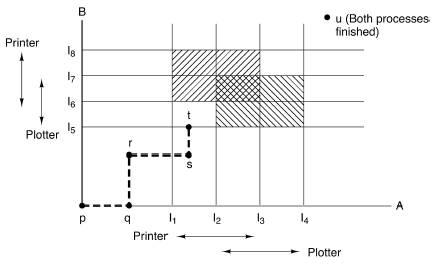
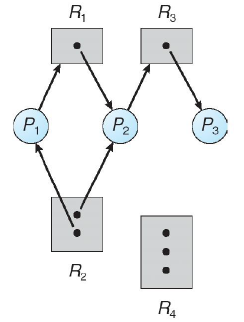
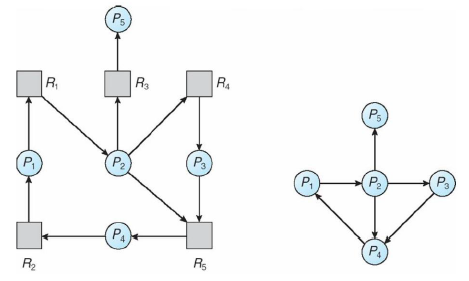

[zurück](README.md)

# 08: Synchronization and Deadlocks

> 20.11.2017, 21.11.2017

## Table of Contents

- [Classic synchronization problems](#classic-synchronization-problems)
    - [POSIX thread synchronization](#posix-thread-synchronization)
        - [Pthread mutex](#pthread-mutex)
        - [Producer-consumer problem](#producer-consumer-problem)
            - [First implementation](#first-implementation)
            - [Improvements using mutex](#improvements-using-mutex)
        - [Condition variables](#condition-variables)
        - [Pthread condition variables](#pthread-condition-variables)
            - [Solution with condition variables](#solution-with-condition-variables)
    - [Readers-writers problem](#readers-writers-problem)
        - [1st problem: readers preference](#1st-problem-readers-preference)
        - [2nd problem: writers preference](#2nd-problem-writers-preference)
        - [3rd problem: bounded waiting](#3rd-problem-bounded-waiting)
    - [Dining-philosophers problem](#dining-philosophers-problem)
        - [Naive solution with `mutex_t chopstick[5]`](#naive-solution-with-mutext-chopstick5)
- [Deadlocks](#deadlocks)
    - [Deadlocks countermeasures](#deadlocks-countermeasures)
        - [Prevention](#prevention)
        - [Avoidance](#avoidance)
        - [Resource allocation graph (RAG)](#resource-allocation-graph-rag)
    - [Recovery from deadlock](#recovery-from-deadlock)
        - [Process termination](#process-termination)
        - [Resource preemption](#resource-preemption)

## Classic synchronization problems

### POSIX thread synchronization

POSIX provides a number of synchronization constructs that are based on spinlocks and semaphores as described in the last lecture, e.g.
- `pthread_mutex_t` provides semaphore functionality (implemented as futex in Linux)
- `pthread_cond_t` implements **condition variables** which are similar to a **counting semaphore** but with easier syntax
- `pthread_rwlock_t` implements **reader-writer-lock**

#### Pthread mutex

| Pthread mutex call      | Description                                 |
| ----------------------- | ------------------------------------------- |
| `pthread_mutex_init`    | Create and initialize a new mutex           |
| `pthread_mutex_destroy` | Destroy and free existing mutex             |
| `pthread_mutex_lock`    | Enter critical section or block             |
| `pthread_mutex_trylock` | Enter critical section or return with error |
| `pthread_mutex_unlock`  | Leave critical section                      |

Mutexes that have been allocated in a static way can be initialized with `PTHREAD_MUTEX_INITIALIZER` which is equal to calling `pthread_mutex_init` with a `NULL` attribute.

Mutexes that have been allocated dynamically (on the heap/stack) need to be destroyed using `pthread_mutex_destroy` _before_ freeing them!

`pthread_mutex_trylock` returns `EBUSY` if it cannot enter the critical section (see `man errno`).

Example on how to use Pthread mutexes:
```c
typedef struct {
    int count;
    pthread_mutex_t lock;
} Count;

void inc(Count *num)
{
    pthread_mutex_lock(&num.lock);
    num.count++;
    pthread_mutex_unlock(&num.lock);
}

void dec(Count *num)
{
    pthread_mutex_lock(&num.lock);
    num.count--;
    pthread_mutex_unlock(&num.lock);
}
```

```c
int main()
{
    Count num;
    num.count = 0;
    pthread_mutex_init(&num.lock, NULL);

    int i;
    #pragma omp parallel for
    for (i = 0; i < 42; ++i) {
        inc(&num);
        dec(&num);
    }

    [...]

    pthread_mutex_destroy(&num.lock);

    [...]
}
```

#### Producer-consumer problem

The **producer-consumer problem** is also known as **bounded-buffer problem** and can be explained using a shared buffer (LIFO here) between a producer and a consumer.

An integer `count` keeps track of the number of currently available items that have been produced. Every time the **producer** produces an item, the item is placed in the buffer and `count` is incremented. When the available buffer space is full, the **producer** needs to sleep until an item was consumed by the **consumer**. Every time the **consumer** uses an item, it is removed from the buffer and `count` is decremented. If the buffer is empty, the **consumer** needs to sleep.

##### First implementation

Let’s implement this example:

```c
void producer()
{
    Item newItem;

    for (;;) {
        newItem = produce();

        if (count == MAX_ITEMS)
            sleep();

        insert(newItem);
        count++;

        if (count == 1)
            wakeup(consumer);
    }
}

void consumer()
{
    Item item;

    for (;;) {
        if (count == 0)
            sleep();

        item = remove();
        count--;

        if (count == MAX_ITEMS - 1)
            wake_up(producer);

        consume(item);
    }
}
```

**The problem**: race condition on `count` as demonstrated in the previous chapter.

##### Improvements using mutex

```c
void producer()
{
    Item newItem;

    for (;;) {
        newItem = produce();

        if (count == MAX_ITEMS)
            sleep();
        mutex_lock(&lock);          // add lock
        insert(newItem);
        count++;
        mutex_unlock(&lock);        // unlock again
        if (count == 1)
            wakeup(consumer);
    }
}

void consumer()
{
    Item item;

    for (;;) {
        if (count == 0)
            sleep();
        mutex_lock(&lock);          // add lock
        item = remove();
        count--;
        mutex_unlock(&lock);        // unlock again
        if (count == MAX_ITEMS - 1)
            wake_up(producer);

        consume(item);
    }
}
```

**The problem**: the if condition can still cause a race condition.  
Better solution:

```c
void producer()
{
    Item newItem;

    for (;;) {
        newItem = produce();
        mutex_lock(&lock);          // add lock
        if (count == MAX_ITEMS)
            sleep();

        insert(newItem);
        count++;

        if (count == 1)
            wakeup(consumer);
        mutex_unlock(&lock);        // unlock again
    }
}

void consumer()
{
    Item item;

    for (;;) {
        mutex_lock(&lock);          // add lock
        if (count == 0)
            sleep();

        item = remove();
        count--;

        if (count == MAX_ITEMS - 1)
            wake_up(producer);
        mutex_unlock(&lock);        // unlock again
        consume(item);
    }
}
```

**Problem**: the producer cannot work when consumer is sleeping (because it is holding a lock) and vice versa. We have a _deadlock_ here.

Our last try using mutexes:

```c
void producer()
{
    Item newItem;

    for (;;) {
        newItem = produce();
        mutex_lock(&lock);          // add lock
        if (count == MAX_ITEMS) {
            mutex_unlock(&lock);    // unlock when sleeping
            sleep();
            mutex_lock(&lock);      // lock again when waking up
        }

        insert(newItem);
        count++;

        if (count == 1)
            wakeup(consumer);
        mutex_unlock(&lock);        // unlock again
    }
}

void consumer()
{
    Item item;

    for (;;) {
        mutex_lock(&lock);          // add lock
        if (count == 0) {
            mutex_unlock(&lock);    // unlock when sleeping
            sleep();
            mutex_lock(&lock);      // lock again when waking up
        }

        item = remove();
        count--;

        if (count == MAX_ITEMS - 1)
            wake_up(producer);
        mutex_unlock(&lock);        // unlock again
        consume(item);
    }
}
```

**Problem**: the solution is still racy and can cause signal loss.

#### Condition variables

Our problem can be solved with a mutex and two counting semaphores. The idea:
- new operation that performs unlock, sleep and lock atomically
- new wake-up operation that is called with lock held
=> simple mutex lock/unlock around critical section + no signal loss

#### Pthread condition variables

| Pthread cond variables call | Description                                     |
| --------------------------- | ----------------------------------------------- |
| `pthread_cond_init`         | Create and initialize condition variable        |
| `pthread_cond_destroy`      | Destroy and free an existing condition variable |
| `pthread_cond_wait`         | Block waiting for a signal                      |
| `pthread_cond_timedwait`    | Block waiting for a signal or timer             |
| `pthread_cond_signal`       | Signal another thread to wake up                |
| `pthread_cond_broadcast`    | Signal all threads to wake up                   |

##### Solution with condition variables

Using two condition variables: `more` and `less`.

```c
void producer()
{
    Item newItem;

    for (;;) {
        newItem = produce();

        mutex_lock(&lock);           // lock
        while (count == MAX_ITEMS)
            cond_wait(&less, &lock); // wait

        insert(newItem);
        count++;

        cond_signal(&more);          // signal
        mutex_unlock(&lock);         // unlock
    }
}

void consumer()
{
    Item item;

    for (;;) {
    	mutex_lock(&lock);           // lock
        while (cond == 0)
        	cond_wait(&more, &lock); // wait

        item = remove();
        count--;

        cond_signal(&less);          // signal
        mutex_unlock(&lock);         // unlock

        consume(item);
    }
}
```

### Readers-writers problem

Our problem is that many threads try to read or write to the same data at the same time. Reader only read the data set and do not perform any updates, while writers can both read and write.

Using a single mutex for read and write operations is not a good solution as it unnecessarily blocks out multiple readers while not writer is present.  
**Idea**: locking should reflect different semantics for reading data and for writing data. If no thread writes, multiple readers may be present. If a thread writes, no other readers and writers are allowed.

#### 1st problem: readers preference

No reader should have to wait if other readers are already present

```c
void writer()
{
    for (;;) {
        // generate data to write

        wait(write_lock);

        // write data

        signal(write_lock);
    }
}

void reader()
{
    for (;;) {
        mutex_lock(&rc_lock);
        readerscount++;

        if (readerscount == 1)
            wait(&write_lock);
        mutex_unlock(&rc_lock);

        // read data
        mutex_lock(&rc_lock);
        readerscount--;
        if (readerscount == 0)
            signal(&write_lock);
        mutex_unlock(&rc_lock);
    }
}
```

=> writer cannot acquire `write_lock` until the last reader leaves the critical section

#### 2nd problem: writers preference

No writer shall be kept waiting longer than absolutely necessary. The code for this is analogous to the 1st problem but with seperate readers- and writers-counts.

_Read “Concurrent Control with Readers and Writers” by Randell if you are interested in code for a solution._

The 1st and 2nd problem still have the same issue: writers can starve in readers preference and readers can starve in writers preference.

#### 3rd problem: bounded waiting

We want _no thread_ to starve. POSIX threads contains readers-writers locks to address this issue:

| Pthread lock call        | Description                          |
| ------------------------ | ------------------------------------ |
| `pthread_rwlock_init`    | Create and initialize a new RW lock  |
| `pthread_rwlock_destroy` | Destroy and free an existing RW lock |
| `pthread_rwlock_rdlock`  | Block until reader lock acquired     |
| `pthread_rwlock_wrlock`  | Block until writer lock acquired     |
| `pthread_rwlock_unlock`  | Leave critical section               |

Using these library functions, multiple readers but only a single writer are let into the critical section. If readers are present while a writer tries to enter the critical section then don’t let further readers in, block until readers finish and let the writer in.

Readers-writers locks make solving the 3rd readers-writers problem a non-issue…  
…unless you have to implement the locks yourself.

```c
void writer()
{
    for (;;) {
        rwlock_wrlock(rw_lock);

        // write data

        rwlock_unlock(rw_lock);
    }
}

void reader()
{
    for (;;) {
        rwlock_rdlock(rw_lock);

        // read data

        rwlock_unlock(rw_lock);
    }
}
```

### Dining-philosophers problem

The dining philosophers problem models multiple threads competing for a limited number of resources. The basic idea is that five philosophers do their cyclic workflow over and over again:

1. Think
2. Get hungry
3. Grab for one chopstick
4. Grab for other chopstick
5. Eat
6. Put down chopstick


There are a few assumptions:

- No communication
- No “atomic” grabbing of both chopsticks
- No wrestling

#### Naive solution with `mutex_t chopstick[5]`

What will happen if all philosophers grab their left chopstick at once?

```c
void philosopher(int i)
{
    for (;;) {
        mutex_lock(chopstick[i]);
        mutex_lock(chopstick[(i + 1) % 5]);
        // eat
        mutex_unlock(chopstick[i]);
        mutex_unlock(chopstick[(i + 1) % 5]);
        // think
    }
}
```

The philosophers will end up in a **deadlock**. Possible workarounds include:

- just four philosophers are allowed at a table of five seats (example for **deadlock avoidance**)
- odd philosophers take left chopstick first, even philosophers take right chopstick first (example for **deadlock prevention**)

## Deadlocks

**Deadlocks** can arise if all four conditions hold simultaneously:

1. Mutual exclusion: limited access to resource or resource can only be shared with a finite amout of users
2. Hold and wait: wait for next resource while already holding at least one
3. No preemption: once the resource is granted, it cannot be taken away but only handed back voluntarily
4. Circular wait: possibility of circularity in graph of requests

Example:


1. Only one intersection
2. Cars block part of the intersection while waiting for the rest
3. Cars don’t diminish into thin air
4. Every one of the four sides waits for the cars that come from the right to give way

### Deadlocks countermeasures

Three approaches to dealing with deadlocks:

- Prevention: Pro-active, make deadlocks impossible to occur in the first place
- Avoidance: Decide on allowed actions based on a-priori knowledge
- Detection: React after deadlock happened (recovery)

#### Prevention

Negate _at least one_ of the required deadlock conditions:

1. Mutual exclusion: buy more resources, split into pieces, virtualize -> “infitine” num of instances
2. Hold and wait: get all resources en-bloque/2-phase-locking
3. No preemption: virtualize to make preemtable (virtual vs. physical memory, spooling)
4. Circular wait: ordering of resources (e.g. always acquire mutex `m1` before `m2`)

#### Avoidance



- If a system is in safe state -> no deadlocks
- If a system is in unsafe state -> deadlocks possible

On every resource request decide whether system stays in safe state (needs a-prior information), use a resource allocation graph for that.



#### Resource allocation graph (RAG)

In the **resource allocation graph**, round nodes represent processes and square nodes represent resources. Every instance of a resource is depicted as a dot in the resource node.

Resources requests and assignments are edges:

- resource pointing to process means _resource is assigned to process_
- process pointing to resource means _process is requesting resource_
- process _may_ request resource: claime edge (depicted as dotted line)



Deadlock detection: allow system to enter deadlock -> detection -> recovery scheme

The system maintains a **wait-for graph** (WFG). Nodes are processes, an edge represents “wait for” relationship (like in the RAG but without resources).



Then, periodically invoke an algorithm that searches for a cycle in the graph. It it finds one, there is a deadlock.

### Recovery from deadlock

#### Process termination

Abort all deadlocked processes or abort one process at a time until the deadlock cycle is eliminated.

In which order should we choose to abort?

- Priority of the process
- How long process has computed and how much longer to completion
- Resources the process has used
- Resources process needs to complete
- How many processes will need to be terminated?
- Is process interactive or batch?

#### Resource preemption

- Select a victim by minimizing cost
- Do periodic snapshots to be able to abort process, preempt resources and rollback to previous safe state
- Same process may always be picked as victim (starvation), include number of rollback as cost factor to prevent this
