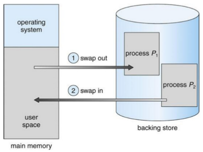
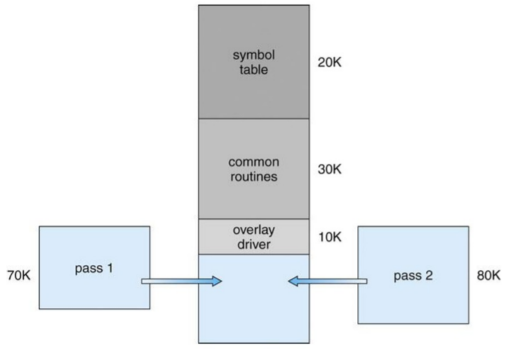
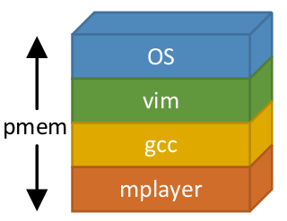
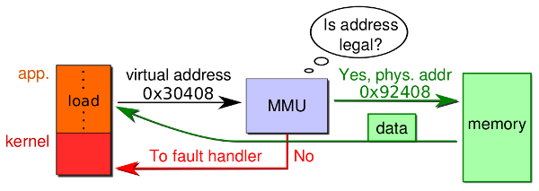
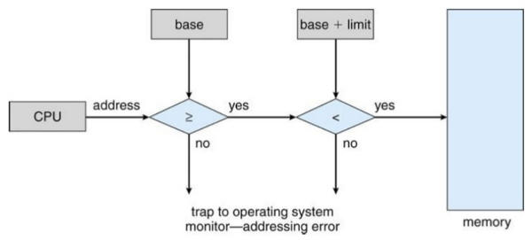
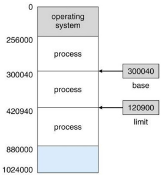
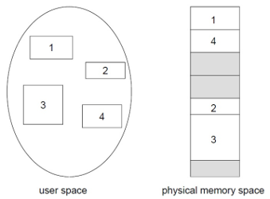
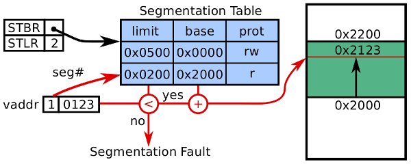
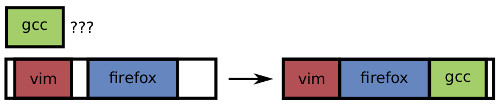

[zurück](README.md)

# 09: Memory management hardware

> 27.11.2017

## Table of Contents

- [Motivation](#motivation)
- [Swapping](#swapping)
    - [Overlays](#overlays)
- [Static relocation](#static-relocation)
- [Virtual memory](#virtual-memory)
    - [Memory management unit](#memory-management-unit)
- [Base + limit](#base--limit)
    - [Protecting the kernel](#protecting-the-kernel)
    - [Conclusion](#conclusion)
- [Segmentation](#segmentation)
    - [Architecture](#architecture)
    - [Conclusion](#conclusion)
    - [Fragmentation](#fragmentation)
- [Paging](#paging)
    - [Address translation scheme](#address-translation-scheme)
    - [Hierarchical page table](#hierarchical-page-table)
        - [Intel x86-64 page table hierarchy](#intel-x86-64-page-table-hierarchy)
    - [Page table entry content](#page-table-entry-content)
    - [The OS’s involvement in paging](#the-oss-involvement-in-paging)
    - [Internal fragmentation](#internal-fragmentation)
    - [Conclusion](#conclusion)

## Motivation

The CPU is only capable of accessing the main memory and the registers, no other storage. We do however want to load programs from background storage to be able to run them.

Also, while early computers didn’t have any memory abstraction and all programs accessed the physical memory directly, we don’t want to do that anymore.

Multiple processes should also be able to run concurrently even without memory abstraction, for that we’ll use **swapping** and **static relocation**.

## Swapping

When talking about **swapping**, that means

1. saving a program’s state on background storage (roll-out)
2. replacing it with another program’s state (roll-in)

Positive:

- Hardware support only required to protect the kernel, not required to protect processes from one another

Negative:

- Very slow (total transfer time proportional to the amout of memory swapped)
- No parallelism: the currently running process owns the entire physical address space

### Overlays

What if the process you want to run needs more memory than physically available?

- We need to partition our program manually

## Static relocation

**Static relocation** is another possibility to solve address conflicts when loading multiple processes. The idea is that the OS adds a fixed offset to every address in a program when loading and executing it.

However all processes still run inside the same physical address space. This means every program can still read and write to every address.

Also this solution isn’t very flexible. Assume a situation as presented in the graphic above. What if…

- …`gcc` needs more memory for it’s abstract syntax tree?
- …`mplayer` is pausing playback and currently doesn’t need that much memory? (re-use of memory by other process?)
- …a new process doesn’t fit into a contiguous free region?

We want programs to co-exist peacefully. Therefore, we’re in need for dynamic allocation and mutual protection!

## Virtual memory

When sharing physical memory, a few properties are desired (e.g. for security reasons):

- Protection
    - a bug in one process must never corrupt memory in another process
    - don’t allow processes to observe other processes’ memory (pgp/ssh-agent)
- Transparency
    - a process shouldn’t require particular physical memory addresses
    - processes should be able to use large amounts of contiguous memory
- Resource exhaustion
    - allow that the sum of sizes of all processes is greater than physical memory

### Memory management unit

We need hardware support to achieve safe and secure protection. The **memory management unit** (MMU) maps virtual addresses to physical addresses. A user program never deals with physical addresses but instead always uses virtual ones.

A question still remains: how does a MMU work?

## Base + limit

**Idea**: use the MMU for protection and dynamic relocation. For that, introduce special **base** and **limit** registers.

For every load or store operation, the MMU
1. checks if the virtual address is larger or equal to `base`
2. checks if the virtual address is smaller than `base + limit`
3. use the virtual address as the physical address in memory

### Protecting the kernel

Using base and limit registers, we can protect the OS from processes by splitting the memory into two partitions:

- the operating system is held in **low memory** with interrupt vector
- processes are held in **high memory**

The OS can access all process partitions (e.g. to copy syscall parameters) while all other processes are denied access to OS memory by the MMU.

### Conclusion

While the base and limit registers solve a few problems, they’re still not ideal for our requirements.

**Positive**:

- Straightforward to implement MMU (only need to load new base and limit registers to switch address space)
- Very quick at runtime (only two comparisons that can be done in parallel, pre-computation of `base + limit`)

**Negative**:

- How do you grow a process’ address space?
- How do you share code or data?

## Segmentation

A possible solution to shortcomings of the base + limit approach is to use _multiple_ base + limit register pairs per process.

⇒ some **segments** can be kept private while others are shared

### Architecture

Every virtual address consists of a tuple: `(segment #, offset)`. These can be encoded in the address and selected by an instruction or and operand.

Each process (= each address space) has a seperate **segment table** that maps a virtual address to physical addresses in memory. The table is defined by three columns:

- **Base**: starting physical address where the segment resides in the memory
- **Limit**: length of the segment
- **Protection**: access restriction (read/write) to make safe sharing possible

The MMU has two registers to identify the current address space:

- The **segment-table base register** (STBR) points to the segment table location of the current process
- The **segment-table length register** (STLR) indicates the number of segments used by the process (upper limit)

### Conclusion

**Positive**:

- Data/code sharing between processes is made possible without safety/security concerns
- A process doesn’t need a large contiguous physical memory area

**Negative**:

- Segments need to be kept contiguous in physical memory
- **Fragmentation** of physical memory

### Fragmentation

**Fragmentation** is the inability to use free memory.  
**External fragmentation** means that the sum of free memory satisfies the requested amount, however configuous memory is required.

External fragmentation can be reduced by **compaction**:

- close gaps by moving allocated memory in one direction (e.g. towards 0x00)
- large free block that results is contiguous and can be used by new processes

Keep in mind that compaction is _very_ expensive: processed need to be halted while moving data and updating tables, caches need to reload afterwards  
⇒ should be avoided

## Paging

_See chapter 10 for paging._
