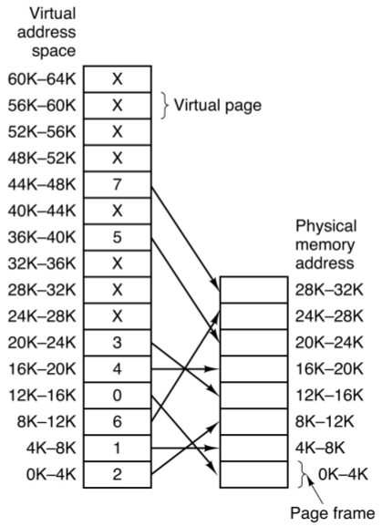
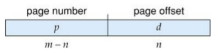
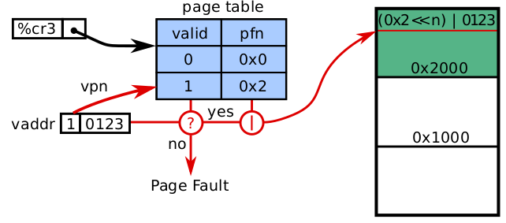
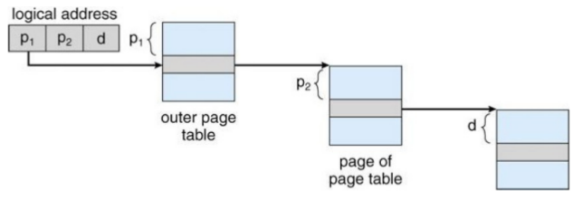
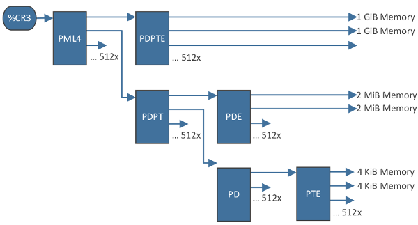
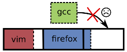

[zurück](README.md)

# 09: Memory management hardware

> 27.11.2017

## Table of Contents

- [Motivation](#motivation)
- [Swapping](#swapping)
    - [Overlays](#overlays)
- [Static relocation](#static-relocation)
- [Virtual memory](#virtual-memory)
    - [Memory management unit](#memory-management-unit)
- [Base + limit](#base--limit)
    - [Protecting the kernel](#protecting-the-kernel)
    - [Conclusion](#conclusion)
- [Segmentation](#segmentation)
    - [Architecture](#architecture)
    - [Conclusion](#conclusion)
    - [Fragmentation](#fragmentation)
- [Paging](#paging)
    - [Address translation scheme](#address-translation-scheme)
    - [Hierarchical page table](#hierarchical-page-table)
        - [Intel x86-64 page table hierarchy](#intel-x86-64-page-table-hierarchy)
    - [Page table entry content](#page-table-entry-content)
    - [The OS’s involvement in paging](#the-oss-involvement-in-paging)
    - [Internal fragmentation](#internal-fragmentation)
    - [Conclusion](#conclusion)

## Motivation

The CPU is only capable of accessing the main memory and the registers, no other storage. We do however want to load programs from background storage to be able to run them.

Also, while early computers didn’t have any memory abstraction and all programs accessed the physical memory directly, we don’t want to do that anymore.

Multiple processes should also be able to run concurrently even without memory abstraction, for that we’ll use **swapping** and **static relocation**.

## Swapping

When talking about **swapping**, that means

1. saving a program’s state on background storage (roll-out)
2. replacing it with another program’s state (roll-in)

**Positive:**

- Hardware support only required to protect the kernel, not required to protect processes from one another

**Negative:**

- Very slow (total transfer time proportional to the amout of memory swapped)
- No parallelism: the currently running process owns the entire physical address space

### Overlays

What if the process you want to run needs more memory than physically available?

- We need to partition our program manually

## Static relocation

**Static relocation** is another possibility to solve address conflicts when loading multiple processes. The idea is that the OS adds a fixed offset to every address in a program when loading and executing it.

However all processes still run inside the same physical address space. This means every program can still read and write to every address.

Also this solution isn’t very flexible. Assume a situation as presented in the graphic above. What if…

- …`gcc` needs more memory for it’s abstract syntax tree?
- …`mplayer` is pausing playback and currently doesn’t need that much memory? (re-use of memory by other process?)
- …a new process doesn’t fit into a contiguous free region?

**We want programs to co-exist peacefully. Therefore, we’re in need for dynamic allocation and mutual protection!**

## Virtual memory

When sharing physical memory, a few properties are desired (e.g. for security reasons):

- Protection
    - a bug in one process must never corrupt memory in another process
    - don’t allow processes to observe other processes’ memory (pgp/ssh-agent)
- Transparency
    - a process shouldn’t require particular physical memory addresses
    - processes should be able to use large amounts of contiguous memory
- Resource exhaustion
    - allow that the sum of sizes of all processes is greater than physical memory

### Memory management unit

We need hardware support to achieve safe and secure protection. The **memory management unit** (MMU) maps virtual addresses to physical addresses. A user program never deals with physical addresses but instead always uses virtual ones.

A question still remains: how does a MMU work?

## Base + limit

**Idea**: use the MMU for protection and dynamic relocation. For that, introduce special **base** and **limit** registers.

For every load or store operation, the MMU
1. checks if the virtual address is larger or equal to `base`
2. checks if the virtual address is smaller than `base + limit`
3. use the virtual address as the physical address in memory

### Protecting the kernel

Using base and limit registers, we can protect the OS from processes by splitting the memory into two partitions:

- the operating system is held in **low memory** with interrupt vector
- processes are held in **high memory**

The OS can access all process partitions (e.g. to copy syscall parameters) while all other processes are denied access to OS memory by the MMU.

### Conclusion

While the base and limit registers solve a few problems, they’re still not ideal for our requirements.

**Positive**:

- Straightforward to implement MMU (only need to load new base and limit registers to switch address space)
- Very quick at runtime (only two comparisons that can be done in parallel, pre-computation of `base + limit`)

**Negative**:

- How do you grow a process’ address space?
- How do you share code or data?

## Segmentation

A possible solution to shortcomings of the base + limit approach is to use _multiple_ base + limit register pairs per process.

⇒ some **segments** can be kept private while others are shared

### Architecture

Every virtual address consists of a tuple: `(segment #, offset)`. These can be encoded in the address and selected by an instruction or and operand.

Each process (= each address space) has a seperate **segment table** that maps a virtual addresse to physical addresses in memory. The table is defined by three columns:

- **Base**: starting physical address where the segment resides in the memory
- **Limit**: length of the segment
- **Protection**: access restriction (read/write) to make safe sharing possible

The MMU has two registers to identify the current address space:

- The **segment-table base register** (STBR) points to the segment table location of the current process
- The **segment-table length register** (STLR) indicates the number of segments used by the process (upper limit)

### Conclusion

**Positive**:

- Data/code sharing between processes is made possible without safety/security concerns
- A process doesn’t need a large contiguous physical memory area

**Negative**:

- Segments need to be kept contiguous in physical memory
- **Fragmentation** of physical memory

### Fragmentation

**Fragmentation** is the inability to use free memory.  
**External fragmentation** means that the sum of free memory satisfies the requested amount, however configuous memory is required.

External fragmentation can be reduced by **compaction**:

- close gaps by moving allocated memory in one direction (e.g. towards 0x00)
- large free block that results is contiguous and can be used by new processes

Keep in mind that compaction is _very_ expensive: processed need to be halted while moving data and updating tables, caches need to reload afterwards  
⇒ should be avoided

## Paging

The idea behind **paging** is to divide the physical memory into fixed-sized blocks called **page frames**. Their size is always a power of 2 bytes, typical frame sizes include 4 KiB, 2 MiB and 4 MiB.  
The virtual memory on the other side is divided into blocks called **pages** with the same sizes available as for the frames.

The OS keeps a **page table** that stores mappings between **virtual page numbers** (vpn) and **page frame numbers** (pfn) for each address space. It also keeps track of all free frames and modifies page tables as needed. To run a program of size `n` pages, it needs to find `n` free frames and load the program.

A **present bit** in the table indicates whether a virtual page is currently mapped to physical memory or not.  
The MMU reads the page table and autonomously translates valid mappings. If a process issues an instruction to access a virtual address that is currently _not_ mapped, the MMU calls the OS to bring in the data (**page fault**).

### Address translation scheme

A virtual address is divided into:

- a **virtual page number `p`** which is an index in the **page table** (which contains base address of each page in physical memory)
- a **page offset** that is concatenated with the base address and results in a physical address

### Hierarchical page table

We still have a problem: for _every_ address space, the complete page table (that can map _all_ virtual page numbers) must be kept in memory.

The idea is to use another layer of indirection to only store a small section of the table in our address space, because most virtual addresses aren’t used by our program anyway. For that, divide the virtual address further into multiple page tables indices `pn` forming a **hierarchical page table**.

#### Intel x86-64 page table hierarchy

- x86-64 **long mode**: 4-level hierarchical page table
- **Page directory base register** (control register 3, `%CR3`) stores the starting physical address of the first level page table
- For every address space, the page table hierarchy goes as follows
    - Page map level 4 (PML4)
    - Page directory pointers table (PDPT)
    - Page directory (PD)
    - Page table entry (PTE)
- At each level, the respective table can either point to a directory in the next hierarchy level, or to an entry containing actual mapping data
- Depending on the depth of the entry, the mapping has different sizes:
    - PDPTE: 1 GiB page
    - PDE: 2 MiB page
    - PTE: 4 KiB page

- Intel 4-level paging supports a maximum of 256 TiB virtual address space
    - 48 bit linear addresses
    - with 4 KiB page: 9 bit index into PML4, PDPT, PD, PT; 12 bit page offset
- Processors use 46 bit physical addresses (max. 64 TiB physical memory)
- Intel 5-level pages: extension for larger address space
    - add 9 bits for 5th level of hierarchy ⇒ 128 PiB virtual memory
    - physical address width extended up to 52 bit ⇒ 4 PiB virtual memory

### Page table entry content

- The **valid bit** (aka. **present bit**) stores whether the page is currently available in memory or needs to be brought in by the OS (via page fault)
- The **page frame number** indicates at which physical address the page is currently loaded (if page is present)
- The **write bit** enables/disables writing to the page. If a process writes to a page with a clear write bit, the MMU halts the operation and raises a page fault
- **Caching**: whether this page should be cached at all and with which policy
- **Accessed bit**: set by the MMU to store whether the page was touched since the bit was last cleared by the OS
- **Dirty bit**: set by the MMU to store whether the page was modified since the bit was last cleared by the OS

### The OS’s involvement in paging

The OS performs all operations that require semantic knowledge:

- Page allocation and bringing data into memory (the OS needs to find a free page frame for new pages and set up the mapping)
- Page replacement
    - When all page frames are in use, evict pages from memory to make room for new pages (code section can be dropped and re-read later, heap memory has to be saved to a **pagefile** or **swap area** before frame can be evicted)
- Context switching (OS sets the MMU’s base register (`%CR3` on x86) to point to the page hierarchy of the next process’s address space)

### Internal fragmentation

Paging eliminates external fragmentation due to its fixed size blocks. With paging however, **internal fragmentation** becomes a problem: because the memory can only be allocated in course grained page frame sizes, an unused rest of the last allocated page cannot be used if the allocated virtual memory area doesn’t end at a page boundary (which they typically don’t).

### Conclusion

Paging is great, but we still have to live with some tradeoffs depending on the selected page size:

- Fragmentation:
    - Larger pages ⇒ more memory is wasted due to internal fragmentation for every allocation
    - Small pages ⇒ only half a page wasted for every allocation (on average)
- Table size:
    - Larger pages ⇒ fewer bits needed for pfn (more bits in the offset), fewer PTEs
    - Smaller pages ⇒ more and larger PTEs
    - **Note**: page table hierarchies support multiple page sizes with uniform entries, larger pages need fewer page tables (e.g. x86-64)
- I/O:
    - Larger pages ⇒ more data needs to be loaded from disk to make page valid
    - Smaller pages ⇒ need to trap to OS more often when loading large program
