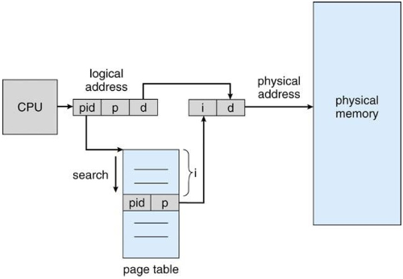

# 10: Paging

> 28.11.2017, 04.12.2017

## Table of contents

_TODO_

## Desired properties when sharing physical memory

- **Protection**: processes should not be allowed to manipulate/observe other process&rsquo; memory
- **Transparency**: processes should not need to rely on knowing physical memory
- **Resource exhaustion**: allow the sum of memory allocated by all processes to be greater than actual physical memory

See chapter 9 for more information.

## Memory management unit

Safe and secure memory protection can only be achieved in hardware.
A hardware device called **memory management unit** (MMU) maps virtual to physical addresses.
Userspace programs only deal with those virtual addresses and never see real physical ones.

_TODO: insert image from 3/29._

## Paging

**Paging** describes dividing physical memory into chunks of fixed size called **page frames**.
Typical frame sizes are between 1KiB and 4MiB.

The operating system maintains a **page table** that represents a mapping from **virtual page numbers** (VPNs) to **page frame numbers** (PFNs).
A **present bit** in this table indicates whether a virtual page is currently mapped to physical memory.
The MMU accesses the page table and translates virtual addresses into physical addresses.
If a process issues an instruction that accesses an invalid virtual address, the MMU calls the kernel for handling the situation (**page fault**).


### Page table entry

The following is a list of fields a page table entry may have.
Which fields the entry actually has depends on the system used.
Except for the **valid bit** and the **page frame number, all of these are optional.

- **Valid bit**/**present bit**: whether the page is currently used
- **Page frame number**: base address of the physical memory page
- **Write bit**: whether the page is writable. Writing to a page where this bit is clear will raise a page fault
- **Caching**: what policy this page should be cached with (may be not at all)
- **Accessed bit**: set by the MMU when the page is touched
- **Dirty bit**: set by the MMU when the page is modified

### The operating system and paging

The operating system performs operations that require semantic knowledge:

- Page allocation (finding a free page frame in the page table)
- Page replacement (some pages are replaceable, e.g. heap segments that can be swapped to a **pagefile** or **swap area**)
- Context switches (OS sets the MMU&rsquo;s base register (e.g. `%CR3` on x86) to point to the page hierarchy of the another process&rsquo; address space

### Page size trade-offs

Paging eliminates external fragmentation due to its fixed size blocks.
However, **internal fragmentation** becomes a problem:
If a the memory allocated by a process is not exact multiple of the page size (which is mostly isn&rsquo;t), some of the allocated memory is not used.


- Fragmentation:
    - Large pages ⇒ more memory is wasted due to internal fragmentation
    - Small pages ⇒ less internal fragmentation
- Page table size:
    - Large pages ⇒ less pages ⇒ fewer bits for page frame numbers, fewer page table entries
    - Small pages ⇒ more pages ⇒ more bits for page frame numbers, more page table entries
    - Note: some page table layouts support multiple page sizes (e.g. x86-64)
- I/O:
    - Small pages ⇒ more page faults when loading big chunks of data ⇒ more overhead

## Page table layouts

### Linear page table

In this layout, a virtual address consists of a **virtual page number** (VPN) and a **page offset**.
The virtual address is an index in an array of base addresses.
The physical address is the sum of the base address and the page offset.


Linear page tables are not used in practice, because the use a _lot_ of space.

### Hierarchical page table

Each process needs to have a mapping for all VPNs at all times; however, most processes only use a small slice of their available VPNs.
This means that most processes do not need to have access to the whole page table.
An **hierarchical page table** splits up the address space into multiple smaller page tables.

The problem of hierarchical tables usually is that a lot of lookups (slow main memory accesses) are needed per resolved address.

### Linear inverted page table

An **inverted page table** stores mapping _from_ physical addresses to VPNs.
Only one table per system is needed, because one table can serve all processes.
This way, it uses only a fraction of the memory a linear or hierarchical page table would.



The problem is that resolving an address happens in linear time, proportional to the amount of page frames.

### Hashed inverted page table

Just like an inverted page table, but a **hash anchor table**, indexed by hashed virtual page numbers, limits the search to at most a few page table entries.


#### Typical lookup in an hashed inverted page table

1. Hash virtual page number part of virtual address
2. Lookup the page table entry using this hash
3. If the virtual page number of the entry does not match the one of the virtual address, look at the next one and repeat this step
4. Use the page table entry to make the physical address


## Translation lookaside buffer

Memory lookups often happen sequentially (e.g. array accesses, reading instructions) and thus only a few pages are used most of the time.
The **translation lookaside buffer** (TLB) caches results of page table lookups.

### Naiive paging is slow

_TODO: 21/29_

Caches lookups in order to make further lookups fast.

### TLB operation

Many TLB entries can be compared at the same time in hardware.
That&rsquo;s what makes the TLB fast.
On every memory load and store operation, check if result is already cached, if not, look it up in the page table and insert it into the cache.

_TODO: 22/29_

### Address space identifiers

_TODO: 24/29_

### TLB reach

**TLB reach** (also known as **TLB coverage**) describes the amount of memory accessible with TLB hits.
The formula is:

```
TLB_reach = TLB_size * page_size
```

Ideally, the working set of each process is stored in the TLB.

In order to increase the TLB reach, we can either increase the TLB size or the page size.
Increasing TLB size is very expensive; increasing page size increases internal fragmentation.

A good approach is to provide different page sizes.
This allow processes to allocate larger memory areas without filling the TLB too much and increasing internal fragmentation.

### Effective access time

_TODO: 26/29_

## System virtualization

Goal: mapping guest page tables to host page tables efficiently.

_TODO: introduction 9/17_

### Hosted and bare-metal

_TODO: 10/17_

### Two levels of page tables

Host OS translates between physical and virtual (physical for the guest) addresses.
Hypervisor translates between virtual and guest-virtual addresses.

#### Shadow page tables

Software-based virtualization of page tables.
To keep PTs in sync: intercept changes to CR3, bits, &hellip;
Adds too much overhead.

#### Hardware based virtualization

Hardware implements PT capacities for seperate page tables.

_TODO: 15/17_

Advantages, disadvantages.

## Examples

### Example: two-level page table

On a 32-bit machine using pages of 4 KiB, virtual addresses are divided into:

- Page number (p): 20 bits
- Page offset (d): 12 bits

The page table itself can be paged in order to save memory.
The page number p is subdivided into:

- Index in **page directory** (p1): 10 bits
- Index in **page table entry** (p2): 10 bits


### Example: 32-bit Intel architecture (IA-32)

IA-32 divides a virtual address into a 10-bit directory pointer, a 10-bit table pointer and a 12-bit offset.


The **page directory** contains pointers to a page tables.
The directory pointer points to such an entry.


The **page table**s contain pointers to actual pages.
The offset is added to such a pointer to get the physical address.


### Example: Intel/AMD x86 64-bit

- x86-64 **long mode**: 4-level hierarchical page table
- **Page directory base register** (control register 3, `%CR3`) stores the starting physical address of the first level page table
- For every address space, the page table hierarchy goes as follows
    - Page map level 4 (PML4)
    - Page directory pointers table (PDPT)
    - Page directory (PD)
    - Page table entry (PTE)
- At each level, the respective table can either point to a directory in the next hierarchy level, or to an entry containing actual mapping data
- Depending on the depth of the entry, the mapping has different sizes:
    - PDPTE: 1 GiB page
    - PDE: 2 MiB page
    - PTE: 4 KiB page


- Intel 4-level paging supports a maximum of 256 TiB virtual address space
    - 48 bit linear addresses
    - with 4 KiB page: 9 bit index into PML4, PDPT, PD, PT; 12 bit page offset
- Processors use 46 bit physical addresses (max. 64 TiB physical memory)
- Intel 5-level pages: extension for larger address space
    - add 9 bits for 5th level of hierarchy ⇒ 128 PiB virtual memory
    - physical address width extended up to 52 bit ⇒ 4 PiB virtual memory

### Example: ARM 32-bit

- 1 MiB pages with a 1 level page table: 12/20
- 64 KiB pages with a 2 level page table: 12/4/16
- 4 KiB pages with a 2 level page table: 12/8/12

In newer architectures, the subpages shown below are deprecated.


### Example: ARM 64-bit

- 512 MiB pages with a 2 level page table: 1/13/29


- 64 KiB with a 3 level page table: 1/13/13/16


- Additional level using bits 47 to 42 supported

### Example: PowerPC 32-bit

- Combination of segmentation and inverted page table
- Segementation yields virtual base, hash indicates entry in page table bucket
- CPU searches page table bucket, calls OS if no matching entry exists


