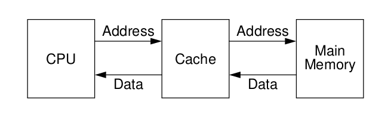
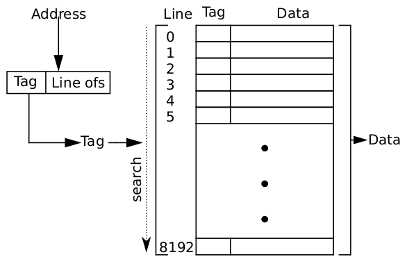
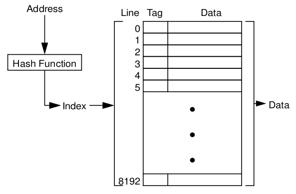
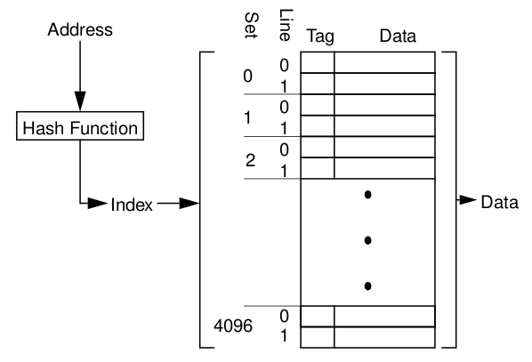
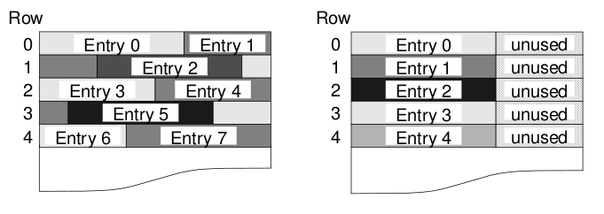
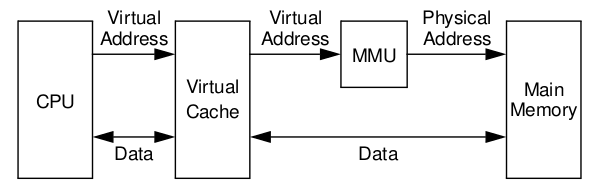
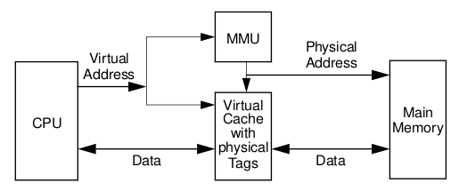
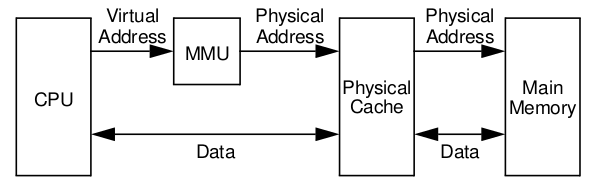
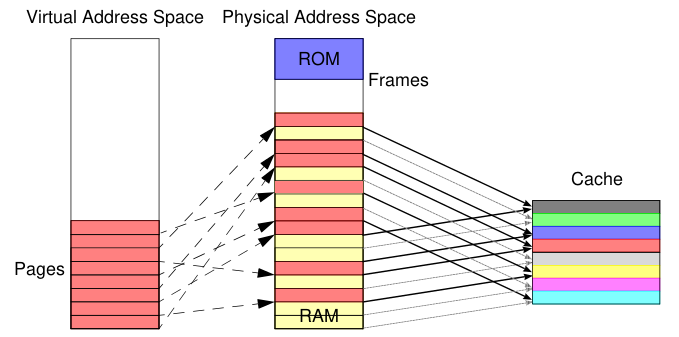
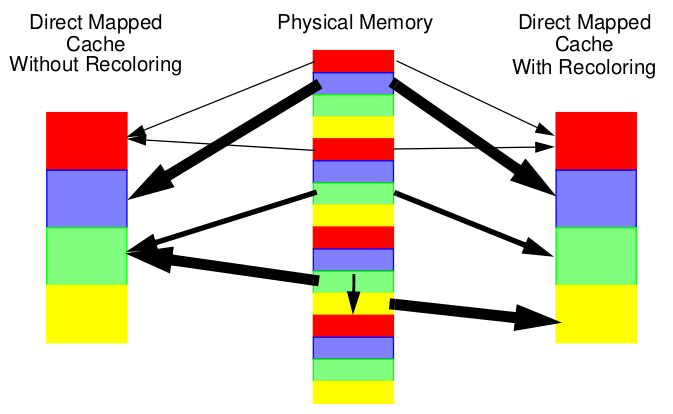

# 11: Caching

> 05.12.2017, 11.12.2017

## Managing memory

Memory needs to be managed carefully.
That is because while ideal memory would be fast, cheap, non-volatile and large, in reality there is always a compromise:

- HDD: large, cheap and non-volatile but slow
- SSD: fairly large, fairly cheap, fairly fast and non-volatile
- RAM: fast but comparatively small, volatile and expensive
- SRAM/registers: extremely fast but small, volatile and extremely expensive

In order to speed up accesses to large memory, **caches** are put between them and the CPU.

## CPU-cache location

The CPU-cache…

- is a buffer for data exchanges between the CPU and memory
- exploits temporal and spatial locality
- has low latency and high bandwidth
- reduces accesses to main memory
- reduces traffic on the memory bus (which is important for multi-CPU systems)
- is a buffer for asynchronous prefetch operations

## Caches misses

A **cache miss** occurs when data is read from memory that is not stored in the cache.
There are three types of cache misses.

### Compulsory miss

This kind of miss occurs when the data being read has not yet been stored in the cache.

### Capacity miss

This kind of miss occurs when the requested data has previously been evicted from the cache to make room for other data.

### Conflict miss

Depending on cache organization, items in the cache may interfere with each other.
**Fully associative** caches (see below) can never have conflict misses.

## Write and replacement policies

### Write-through

When writing data on a cache hit, always update the cache and main memory.

This makes writes slow but assures that main memory is always up to date.

### Write-back

When writing data on a cache hit, always update the cache only; write to main memory only when an entry is evicted from the cache.

This makes write very fast, as only the cache is updated.
However, main memory may be inconsistent.

### Write-allocate

When writing data on a cache miss, put it into the cache first and then act like it was a cache hit (apply the write policy).

### Write-to-memory

When writing data in a cache miss, only perform updates in main memory.

## Cache organization

### Fully associative cache

Memory addresses are divided into the **tag** and the **line offset**.
Data in the cache is identified by the tag.
A line of data contains 2line offset bytes.
The line offset determines which byte to choose from the cache.
On a cache access, the whole cache is searched for the tag (this can be done in parallel in hardware).

### Direct mapped cache
tag

A hash function (which may just be `addressBits -> addressBits[x..y]`) determines which cache line an address is assigned to.
Data is still identified by some sort of tag (e.g. the first `z` bits of the address).

### Set-associative cache

An `X`-way set-associative cache puts its lines in so-called sets of `X` lines.
To find the line an address is assigned to, the set is determined using some sort of hash function; inside the set, the correct line is determined searching for the address’ tag.

Set-associative caches are a compromise between direct mapped and fully associative caches.
One could say that a 1-way associative cache is the same as a direct mapped cache (number of lines is the same as the number of sets, lines are identified by a hash function only) and an `X`-way associative cache with `X` lines is the same as a fully associative cache (one set, lines are identified by their tag only).

## Cache design parameters

- Size and set size: set-associative with large sets for small caches
- Line lenght: long cache lines for spatial locality
- Write policy: write-back for temporal locality
- Replacement policy
- Whether to use virtual or physical addresses for tagging/indexing

### Long cache lines vs. cache alignment

When the sizes of data structures are not aligned to the length of a cache line, one data structure may span multiple lines.
This can cause multiple cache misses for the use of a single data structure.
A solution is to pad each datastructure to a multiple of the line length.

## Examples

### Virtually indexed, virtually tagged (ARMv4/ARMv5)

#### Ambiguity problem

Identical virtual addresses point to the same physical address at different points in time.

_TODO: more on that_

#### Alias problem

Different virtual addresses point to the same physical address.

_TODO: more on that_

#### VIVT cache management

- On a **context switch**, the cache must be flushed, as it is likely that the same virtual addresses refer to different phyiscal addresses in different contexts.
- On a **fork()**, the child needs a complete copy of the parents address space. If the child runs in the context of the parent, special cache management is needed.
- On an **exec()**, the cache must be flushed. Note that for a **write-back** caches its not necessary to actually write to main memory here, as the contents are overwritten anyway.
- On an **exit()**, the cache must be flushed.
- On a **sbrk()**, the cache must be flushed (for the now invalid memory area).
- Shared memory and memory-mapped files lead to an **alias problem** (multiple virtual addresses point to the same physical address).
    - Can be circumvented by disallowing this or simply not caching it
    - Or make each frame accessible by exactly one virtual address at each point in time by eliminating alias pages

#### VIVT I/O

When performing unbuffered writes, be careful to write back changes before I/O starts.
When performing unbuffered reads, the cache must be flushed.

### Virtually indexed, physically tagged

These kinds of caches are often used as Level-1 caches (e.g. UltraSPARC II: 16 KiB direct mapped).

#### VIPT cache management

- No ambiguities
- No cache flush needed after **context switch**
- When using shared memory or memory mapped files, virtual starting addresses must be mapped to the same cache line
- I/O: cache flushes required as with virtually indexed, virtually tagged I/O

#### VIPT runtime properties

Virtually indexed, phyiscally tagged caches enable fast context switches, interrupt handling and system calls by avoiding lots of cache flushes.

**Deferred write-back** after context switches can lead to less memory accesses (resulting in a performance gain) but, depending on the previous threads access patterns, may also lead to variable execution time. caused by **compulsory misses**.

When using dynamic memory management, **conflict misses** may lead to variable execution time.

Needing to look up the phyiscal address using the MMU may lead to variable search time in the cache.

Problems may also arise from using shared memory in multi-processor systems.
But if you make the cache size a small multiple of the page size (factor 1 to 4), only a small number (1-4) of cache lines need to be invalidated (special cache coherency hardware).

### Physically indexed, physically tagged

Physically indexed, physically tagged (PIPT) caches are completely transparent to the CPU.
They do not require any performance-critical support from the system (including I/O).
Multiprocessor systems can use a cache coherency protocal implemented in hardware (fast).

#### PIPT Random allocation conflicts

Contiguous virtual memory is often mapped to page frames in an arbitrary order.
This may lead to cache conflicts — the cache could only partially be used, or some cache regions could be constantly causing **capacity misses** or **conflict misses**.

_TODO: include formula?_

#### PIPT Conflict mitigation

A solution to the problem above may be to “colour” the virtual pages and page frames sequentially (e.g. red-yellow-green-blue-red-yellow…) and when possible to only assign pages to frames of the same colour.
This can be combined with “**page recolouring**” — i.e. analyzing access pattern and, if it is better in the long term, to recolour a page frame (that is, assigning it to a different area in the cache).

Another method is to divide phyiscal memory into disjoint subsets and to use those subsets for different purposes: for example, red and blue pages for the operating system, yellow pages for a real-time application and green pages for background processes.
