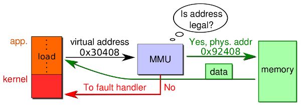

# 12: Page Faults

> 05.12.2017

## Table of contents

- [Revision: Memory Management Unit (MMU)](#revision-memory-management-unit-mmu)
- [Revision: Paging](#revision-paging)
- [Page Fault Handling](#page-fault-handling)
    - [Latency](#latency)
    - [Challenges](#challenges)
        - [What to fetch?](#what-to-fetch)
        - [How to resume?](#how-to-resume)
    - [Shared/Virtual Memory](#sharedvirtual-memory)
        - [Memory-Mapped Files](#memory-mapped-files)
        - [Shared Data Segments](#shared-data-segments)
        - [Copy-On-Write](#copy-on-write)
- [Frame Allocation](#frame-allocation)
    - [Fixed Allocation](#fixed-allocation)
    - [Priority Allocation](#priority-allocation)
    - [Memory Locality](#memory-locality)
    - [Thrashing](#thrashing)
        - [Reasons for Thrashing](#reasons-for-thrashing)
    - [Working-Set Model](#working-set-model)
        - [Keeping Track of the Working Set](#keeping-track-of-the-working-set)
    - [Page Fault Frequency Allocation Scheme](#page-fault-frequency-allocation-scheme)
    - [Example: Solaris](#example-solaris)
    - [Page Fetch Policies](#page-fetch-policies)
        - [Demand-Paging](#demand-paging)
        - [Pre-Paging](#pre-paging)

## Revision: Memory Management Unit (MMU)

The MMU is a hardware device which maps virtual to physical addresses. User programs always use virtual addresses and never see, nor know about, physical addresses.



## Revision: Paging


A so called **present bit** in the page table indicates whether a virtual **page** is currently mapped to physical memory, which the MMU automaticly translates (if valid). If a virtual address is used and currently _not_ mapped to physical memory, the MMU calls the OS to bring in the data. This is called a **page fault**.

## Page Fault Handling


1. OS checks validity of access
2. get an empty frame
3. load contents of requested page from disk into frame
4. adapt page table
5. set present bit of respective entry (e.g. set valid-bit to 1)
6. restart instruction that caused the page fault

### Latency

Let ```p``` with ```0 ≤ p ≤ 1.0``` be the page fault rate. The Effective Access Time (EAT) can then be calculated as follows:

```
EAT = (1 - p) * memory access
         +  p * (page fault overhead + page fault service time + restart overhead)
```

Assuming a memory access time of 200 ns and an average page fault service time of 8 ms:
```
EAT = (1 - p) * 200ns + p * 8ms
    = (1 - p) * 200ns + p * 8.000.000ns
    =           200ns + p * 7.999.800ns
```

If only one access out of 1.000 causes a page fault, the EAT will calculate to 8.2ms which is a slowdown by a factor of 40!

### Challenges

Page faults introduce a set of challenges, including the following questions:

- What to eject? _(=> frame allocation)_
  - how to allocate frames among processes?
  - which pages to keep in memory?
- What to fetch?
  - what if block size != page size?
  - what about prefetching?
- How to resume?
  - saving and resuming state?

#### What to fetch?

The page that caused the page fault must be brought in obviously.

Pre-fetching surrounding pages is also a good idea. Reading two disk blocks is approximately as fast a reading one, also access time is dominated by seek time. Therefore if loading the surrounding blocks doesn't require a track/head switch, pre-fetching pages can be a big win due to next to no extra effort.

Because 0-filled pages (**0-pages**) are required for stack, heap, .bss etc., keeping a pool of 0-pages (being filled in CPU idle) can be a good idea too.

#### How to resume?

To resume a process after a page fault, some extra information is necessary. The hardware therefore provides info about the page fault. On Intel machines for example, the ```%cr2``` register contains the faulting virtual address.

The OS then needs to figure out the context of the fault, this mainly includes identifying the faulting instruction:

- read or write?
- instruction fetch?
- user access to kernel?

**Idempotent instructions can just re-executed**, however more complex instructions must be re-started too.

Some CISC (Complex Instruction Set Computer) instructions are difficult to restart, these include

- block move of overlapping areas
- string move instructions
- auto in-/decrements of multiple locations
- instructions that modify ```%esi```, ```%edi``` or ```%ecx``` registers

Possible solutions include

- touching all relevant pages before operations starts
- keep modified data in registers, page faults can't occur then
- allow partial execution of complex operations

### Shared/Virtual Memory


#### Memory-Mapped Files


Memory-mapped file I/O allows file I/O to be treated as routine memory access by mapping a disk block to a page. Initially, a page-sized portion of the file is read into a physical page. Subsequent reads from/writes to the file are treated as ordinary memory accesses.

This simplifies file access because ```read()``` and ```write()``` system calls aren't necessary. Also, this allows several processes to map the same file.

#### Shared Data Segments


Shared data segments are often implemented with temporary, anonymous memory-mapped files and shared pages.

#### Copy-On-Write

Copy-On-Write (COW) allows a parent and child process to share the same pages in memory. A page is copied only if one of the processes attempts to modify it. The COW mechanism allows more efficient process creation because only modified pages are copied.

_Before process 1 modified page c:_  


_After process 1 modified page c:_  


Example of shared pages:  


## Frame Allocation

One distinguishes between global and local allocation:

- **Global allocation**: _all_ frames are considered for replacement
  - a process can get another process's frame
  - no protection against process that hogs all memory
- **Local allocation**: only _frames of the faulting process_ are considered
  - isolation of processes
  - separately determine how many frame each process deserves

### Fixed Allocation

With **equal allocation**, all processes get the same amount of frames (e.g. 100 frames and 5 processes -> 20 frames per process)

The **proportional allocation** consideres process sizes:  
```
s_i = size of process i
S = ∑ s_i
m = total frame num
```

Allocation ```a_i``` for process ```p_i```:  
```a_i = (s_i / S) * m```

Example:
```
m = 64
s_1 = 10
s_2 = 127

a_1 = (10 / 137) * 64 ≈ 5
a_2 = (127 / 137) * 64 ≈ 59
```

### Priority Allocation

The **priority allocation** scheme uses priorities rather than size. In case process ```p_i``` generates a page fault, select one of its frames or a frame from a process with lower priority for replacement.

### Memory Locality

Paging extends our memory size by using background storage. However background storage is _much_ slower than memory, our goal is to run near memory speed.

The **pareto principle** applies to working sets of processes: 10% of memory gets 90% of the references, there our goal is to keep those 10% in memory. The rest can be outsourced to the disk. But how can we identify those 10%?

  
_Locality in a memory-reference pattern_

### Thrashing

**Thrashing** is the the process of swapping pages in and out. Each time a page is brought in from disk, another page, whose contents will soon be referenced, is thrown out.

This leads to low CPU utilization while processes wait for pages to be fetched from disk. As a consequence, the OS thinks that it needs a higher degree of multiprogramming.


#### Reasons for Thrashing

- The access pattern has no temporal locality and processes don't follow the pareto principle.
- Each process fits in individually, but too many for system
- Memory too small to hold the 10% of processes
- Page replacement policy doesn't work well (see next lecture)

### Working-Set Model

The working-set is a concept that defines how much memory a process requires.

```∆``` (delta) is the time interval (**working-set window**) with a fixed number of page references.

```WSS_i``` is the working set of process ```p_i``` and contains the number of pages referenced in the most recent time ```∆```.  
```∆``` to small: will not encompass entire locality  
```∆``` to large: will encompass several localities  
```∆ = ∞```: will encompass entire programm

```D = ∑ WSS_i```: total demand for frames. If ```D > m```: Thrashing (policy: suspend a process)


#### Keeping Track of the Working Set

Ideally you would replace the page that is going to be referenced furthest in the future, however it's impossible to reliably predict the future.

The first idea is to predict the future from the past by recording page references from the past and extrapolate them into the future. However it's very expensive to maintain an ordered list of all page references at runtime.

Therefore the second idea is to sacrifice precision for speed and let the MMU set the **reference bit** in the respective page table entry _every time a page is referenced_. A timer then scans all page tabe entries for reference bits.

### Page Fault Frequency Allocation Scheme

Establish a “acceptable” page fault rate with an upper and lower bound. If the actual rate is too low, give frames to other processes. Otherwise, allocate more frames to the process.


### Example: Solaris

On Solaris, the kernel maintains a list of free pages to assign to faulting processes.

Paging is performed by the _pageout_ process which scans pages using a modified clock algorithm. The scan rate ranges from _slowscan_ to _fastscan_.


Free memory thresholds determine the behavior of _pageout_:
- _lotsfree_: begin paging
- _desfree_: increase paging
- _minfree_: begin swapping

### Page Fetch Policies

When should the OS allocate new pages?

#### Demand-Paging

Idea: only transfer pages that raise page faults

**Positive**:  
- only transfer what is needed
- less memory needed per process

**Negative**:  
- many initial page faults when a task starts
- more I/O operations

#### Pre-Paging

Idea: speculatively transfer pages to memory. At every page fault, speculate what else should be loaded.

**Positive**:  
- improves disk I/O throughput by reading chunks

**Negative**:  
- wastes I/O bandwidth if page is never used
- can destroy the working set of other processes in case of page stealing
