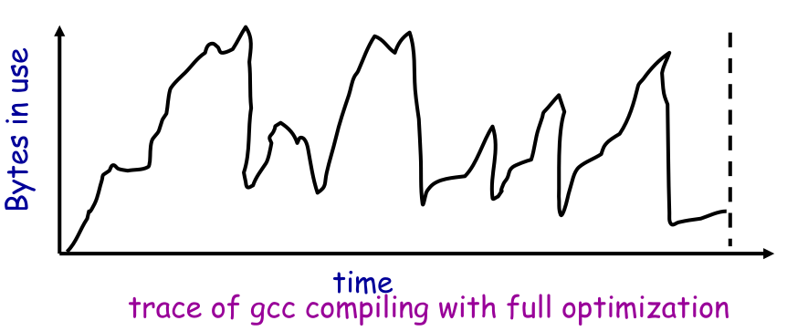

[zurück](README.md)

# 14: Memory Allocation

> 08.01.2018

## Table of contents

## TL;DR

- **Dynamic memory allocation** means allocating and freeing memory chunks of arbitrary size at runtime
- It is provenly impossible to construct a memory allocator that always performs well (Robson)
- The main problem of dynamic memory allocators is **fragmentation**
- Typical data structures used inside dynamic memory allocators are linked lists and bitmaps
- Simple allocation strategies that perform reasonably well are:
    - **best-fit** (choose the smallest free region the requested chunk fits in)
    - **first-fit** (choose the first free region the requested chunk fits in)
- More advanced memory allocators are the buddy allocator and the SLAB allocator that are used in the Linux kernel to allocate page frames and kernel-internal data structures

## Dynamic memory allocation

**Dynamic memory allocation** makes a system able to allocate and free chunks of memory  of arbitrary size at any time.

Because of its many advantages, almost every program uses dynamic memory allocation, via the **heap**.
Those advantages are:

- Not needing to statically specify complex data structures
- Being able to have a programs data grow as a function of input size

In fact, even the kernel uses dynamic memory allocation for its data structures.

On the other hand, the use of dynamic memory has a huge impact on performance.
It is proven that one can not implement a dynamic memory allocator that always performs well.

> &ldquo;For any possible allocation algorithm, there exists a stream of allocation and deallocation requests that defeat the allocator and force it into severe fragmentation.&rdquo; &mdash; Robson

This stream of allocations is called an allocation algorithms “pathological case”.

## What does a dynamic memory allocator do?

The allocator initially has a pool of free memory.
During its lifetime, it accepts **allocation** and **deallocation** requests for that pool.
Thus, the allocator needs to track which parts of its memory are free and which are used.
The allocator has no control over the order or the number of requests it receives.
Once allocated, a used region can not be movement again (within the address space).
That means any bad placement decision taken by the allocator is permanent.
**Fragmentation** is a core problem of allocators.

## Implementation details

### Bitmap

To keep track of which parts of memory are in use, memory is split up in equally sized chunks.
A bitmap is used to store the the allocation status of each chunk.
This approach needs an additional data structure to store the length of each chunk, because otherwise, two adjacent chunks could not be told apart at deallocation.

In the example below, if you were to deallocate chunk B at address 8, without additional information, the allocator would free chunk C too.

### List

There are, generally, two options when using a list for keeping track of the memory pool:
either the allocated regions are in the list, or the free regions.
The latter requires an additional data structure for storing the lengths of allocated regions, but makes it easy to search for free regions.

There is also the compromise between those options; have all regions that the pool is divided in in the list and tag the entries as used or free.

## Why is dynamic memory allocation hard?

As stated above, **fragmentation** is a core problem of dynamic memory allocators.
To recall chapter 9, **external fragmentation** means that the sum of all free space is enough to satisfy a request for allocation, but there is not continuous region that can be used;
**internal fragmentation** means that memory has been overallocated by aligning it into blocks (e.g. 1KiB) and that no free blocks are left although there would be enough free space in other blocks.

Three factors are required for fragmentation to occur:

- Different lifetimes of used data (symmetrical allocations can be done on the stack &rArr; no problem)
- Different sizes of data structures (one single size would not be a problem as any allocation would fit into any hole)
- The inability relocate/resize previous allocations (being able to relocate allocations would eliminate fragmentation)

### An example of a pathological case

Say an application allocates _all_ its memory in chunks of 32 bytes.
It then deallocates every second chunk.
Now, although half of the available memory is free, the application can not allocate any chunks that are longer than 32 bytes.A worst-case example

## Common allocation algorithms

### Best-fit

The whole idea behind the **best-fit** allocation algorithm is to keep big chunks of free memory big until absolutely needed.
Best-fit accomplishes this goal by fitting newly allocated memory into the smallest free chunk possible.
When deallocating memory, adjacent blocks are merged again.

### Worst-fit

The problem with best-fit is **sawdust**: by always allocating the smallest possible chunk, the remaining memory chunks are so small that further allocations won&rsquo;t fit into them.

**Worst-fit** does the exact opposite of best-fit: it puts newly allocated memory into the largest free chunk available to minimize sawdust.
In reality, worst-fit actually leads to more fragmentation than best-fit.

### First-fit

Now if **best-fit** and **worst-fit** both produce fragmentation, you could just as well say &ldquo;Hey, I don&rsquo;t even care&rdquo; and optimize for allocation speed instead.
This technique is called **first-fit**: it finds the first chunk of free memory that is big enough to contain the requested chunk.
First-fit is faster than best-fit and worst-fit and performs similarly to best-fit in practice.

#### Pathological case for first-fit

Combine short-lived allocations of size 2n bytes with long-lived allocations of size n+1 bytes.
Each time a chunk of 2n bytes is freed, it is quickly taken by an n+1 bytes chunk, leaving an useless fragment of n-1 blocks.

#### First-fit sorted by address order

Prefer splitting chunk with lower addresses; chunks with high addresses are only split when necessary (no other chunk is big enough).
This algorithm seemingly sorts the free list by size.
It behaves similarly to best-fit.
The downside is that the seemingly sorted list makes the algorithm have to search through a lot of entries for big requests.

#### LIFO first-fit

Put newly allocated chunks at the start of the list.
This is a cheap and fast allocation policy.

#### Next-fit

Use first-fit, but instead of starting the search at the start of the list, start at the position where the last thing was found.
This approach tends to break down the entire list and leads to bad cache locality.

### Buddy allocator

The buddy allocator is used in the Linux kernel to allocate physical memory.
It allocates memory in chunks in sizes that are powers of 2.
The chunks are **naturally aligned** &mdash; that is, their starting address is a multiple of their size.

Splitting a chunk of size `2^n` at address `m * 2^n` in half yields two chunks of size `2^(n - 1)`, one at `m * 2^n` and the other one at `m * 2^n + 2^n - 1 = (2m + 1) * 2^(n - 1)`, which makes them naturally aligned again.
Two blocks that can be created by splitting a bigger one in half are called buddies.
Merging two buddies of size `2^(n - 1)` obviously creates a chunk of size `2^n` that is naturally aligned.

On an allocation request, the buddy allocator &ldquo;rounds up&rdquo; the requested size to a power of two.
If it can not find a chunk that fits, it splits up larger chunks into buddies until they fit.

### SLAB allocator

The kernel often allocates and deallocates memory for few and specific data objects of fixed size (think **process control blocks**).
A **slab** is made up of multiple pages of contiguous physical memory.
A **cache** contains at least one slab.
The kernel uses caches to store objects of the same kind (and thus size).
The Linux kernel uses the buddy allocator to allocate slabs.

## The real world

So far we&rsquo;ve been treating programs as black boxes.
The allocation and deallocation behavior of most real world programs however, can be described as a combination of these patterns:

### Ramp

Data monotonically accumulates over time.
The program only allocates data, but never (or rarely) deallocates any.

### Peaks

A lot of memory is allocated and then freed in a short period of time, repeatedly.
Fragmentation is likely to happen.

#### Exploiting peaks

In peak phases, a lot of memory is allocated, then everything is freed.
One could introduce a new interface: allocation as before, but free everything at once.
This is called **arena allocation**, **object stack** or `alloca`/procedure call (by compiler people).

An **arena** is a linked list of huge chunks of memory.
It basically works just like the list approach presented above.
The advantages are that it is just as simple as the list approach, and less space is wasted.

### Plateau

A lot of memory is allocated and in use for a long time.

### Other patterns

- Most programs only allocate a small number of different sizes
- Fragmentation is more important at peak use than at low use
- Most allocations are rather small (less than 10 words)

You can utilize those observations by segregating allocated data, i.e. placing seemingly similar allocations next to each other.
For example, chunks that have been allocated at the same time may also be deallocated at the same time.
Also, chunks of differing sizes may be deallocated at different times.
You have to find a good heuristic for determining how similar two allocations are.

Below is an example of a segregation algorithm that places chunks of the same size together.
As you can see, after freeing the grey blocks, the version employing segregation has a lot more continuous free space than the one without.

