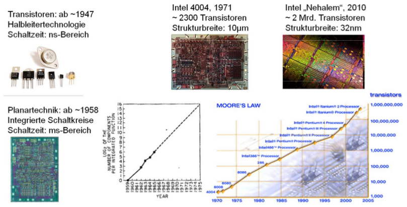

[zurück](README.md)

# Kapitel 1.1: Historische Anmerkungen 

> 18.10.2017

## Inhaltsverzeichnis

- [Ein Blick zurück...](#ein-blick-zurück)
    - [Zuse Z1 (1936)](#zuse-z1-1936)
    - [Zuse Z3 (1941)](#zuse-z3-1941)
    - [MARK I (1944)](#mark-i-1944)
    - [ENIAC (1946)](#eniac-1946)
- [Entwicklung der Rechnertechnologie](#entwicklung-der-rechnertechnologie)
    - [Transistor (1947)](#transistor-1947)
    - [Integrierte Schaltkreise (ca. 1958)](#integrierte-schaltkreise-ca-1958)

## Ein Blick zurück...

Eigenschaften der ersten Computer

| Name | Land | Inbetriebnahme | GK[1](#gleitkomma) | Binär | Elektronisch | Programmierbar | Turingmächtig |
| --- | --- | --- | --- | --- | --- | --- | --- |
| **[Zuse Z3][zuse-z3]** | DE | Mai 1941 | Ja | Ja | Nein | Ja, Lochstreifen | Ja |
| **[Atanasoff-Berry-Computer][atanasoff-berry]** | USA | Sommer 1941 | Nein | Ja | Ja | Nein | Nein |
| **[Colossus][colossus]** | UK | 1943 | Nein | Ja | Ja | Teilweise, Neuverkabelung | Nein |
| **[Mark I][mark-i]** | USA | 1944 | Nein | Nein | Nein | Ja, Lochstreifen | Ja |
| **[Zuse Z4][zuse-z4]** | DE | März 1945 | Ja | Ja | Nein | Ja, Lochstreifen | Ja |
| **[ENIAC][eniac]** | USA | 1946 | Nein | Nein | Ja | Teilweise, Neuverkabelung | Ja |
| **[ENIAC][eniac]** | USA | 1948 | Nein | Nein | Ja | Ja, Widerstands-Matrix | Ja |

[zuse-z3]: https://de.wikipedia.org/wiki/Zuse_Z3
[atanasoff-berry]: https://de.wikipedia.org/wiki/Atanasoff-Berry-Computer
[colossus]: https://de.wikipedia.org/wiki/Colossus
[mark-i]: https://de.wikipedia.org/wiki/Mark_I_(Computer)
[zuse-z4]: https://de.wikipedia.org/wiki/Zuse_Z4
[eniac]: https://de.wikipedia.org/wiki/ENIAC

_Quelle: Wikipedia_

<a name="gleitkomma">1</a>: Gleitkommaarithmetik

### Zuse Z1 (1936)

- Mechanischer Rechner

Heute ausgestellt im deutschen Technikmuseum Berlin.

### Zuse Z3 (1941)

- > Der erste funktionsfähige, frei programmierbare, auf dem binären Zahlensystem (Gleitkommazahlen) und der binären Schaltungstechnik basierende Rechner der Welt.
- Speicherkapazität: 64 Worte zu je 22 Bit
- Operationen: 4 Grundrechenarten u. Quadratwurzel
    - Addition benötigt 3 Takte
    - Multiplikation ~3s
- Takt: 5 Hz 
    - ~1 Gleitkommaoperation pro Sekunde

### MARK I (1944)

Erbaut von: Howard Aiken

- Erster programmgesteuerter Rechenautomat der USA
    - Programm: 24-spuriger Lochstreifen
    - Ein- und Ausgabe: gelochte Papierbänder
- Dezimales Zählrad-Prinzip (Speicher und Rechenelemente sind dekadische Zählräder)
- Abmessungen: 17m lang u. 2,5m breit, ~760.000 Einzelteile

### ENIAC (1946)

Erbaut von: J. Presper Eckert, John W. Mauchly

- Erster elektronischer Universalrechner (Röhrentechnologie m. 17.468 Röhren)
- Programmierung: Verbinden mit Kabeln
- Operationen: 4 Grundrechenarten u. Quadratwurzel, 10-stellige Dezimalzahlen
- Abmessungen: 40 parallel arbeitende Komponenten, je 60cm x 270cm x 70cm (BxHxT), ~70 Tonnen Gewicht

## Entwicklung der Rechnertechnologie

### Transistor (1947)

Ersetzt die Vakuum-Röhre, eröffnet Vorraussetzung für rapides Wachstum integrierter Schaltkreise. Basiert auf Halbleitern, pn-Übergängen.

Erfinder: Shockley, Bardeen, Brattain in den AT&T Bell Labs.  
Nobelpreis in Physik 1956.

### Integrierte Schaltkreise (ca. 1958)

1958 bauen Jack S. Kilby und Robert N. Noyce unabh. voneinander die ersten integrierten Schaltungen.

Kilby wechselte im Mai 1958 zu Texas Instruments in Dallas, US und lötete im September den ersten IC mit Golddräten auf einem Stück Germanium. 2000 erhielt er den Nobelpreis für Physik.  
Zeitgleich erfindet Noyce bei Fairchild Semiconductor den IC unter Verwendung von Silizium und Aluminium. 1968 gründet er mit Gordon Moore die Firma Intel (kurz für **Int**egrated **el**ectronics).

