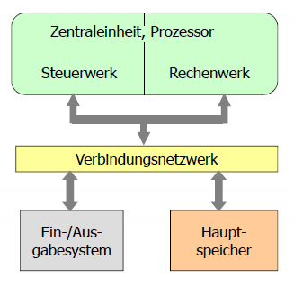

[zurück](README.md)

# Kapitel 3.1: Organisationsprinzip des programmierbaren Universalrechners

> 06.11.2017

## Inhaltsverzeichnis

- [Komponenten des programmierbaren Universalrechners](#komponenten-des-programmierbaren-universalrechners)
    - [Zentraleinheit](#zentraleinheit)
        - [Steuerwerk](#steuerwerk)
        - [Rechenwerk](#rechenwerk)
    - [Hauptspeicher](#hauptspeicher)
    - [Verbindungsnetzwerk](#verbindungsnetzwerk)
    - [Ein-/Ausgabesystem](#ein-ausgabesystem)
- [Phasen der logischen Befehlsausführung](#phasen-der-logischen-befehlsausführung)

## Komponenten des programmierbaren Universalrechners

### Zentraleinheit

Die Zentraleinheit (oft auch „Prozessor” oder „CPU”) verarbeitet Daten gemäß eines Programms. Die Zentraleinheit teilt sich auf in Steuerwerk und Rechenwerk.

#### Steuerwerk

Das Steuerwerk (oft auch „Leitwerk”, „control unit” oder „CU”) holt die Befehle eines Programms aus dem Speicher, dekodiert sie und steuert die Ausführung in der verlangen Reihenfolge durch Steuer- und Statussignale.

#### Rechenwerk

Das Rechenwerk (oft auch „Operationswerk”, „Ausführungseinheit” oder „ALU”) führt die eigentlichen Rechenoperationen (z.B. arithmetisch/logische Operationen) aus. Die auszuführenden Operationen werden durch die Steuersignale des Steuerwerks bestimmt, eine Rückmeldung an das Steuerwerk geschieht über Statussignale.

### Hauptspeicher

Im Hauptspeicher werden Programme und Daten abgelegt (**von-Neumann-Konzept**). Jede Speicherzelle ist eindeutig durch ihre Adresse identifizierbar.

Die alternative **Harvard-Architektur** arbeitet mit getrenntem Programm- und Datenspeicher.

### Verbindungsnetzwerk

Das Verbindungsnetzwerk besteht aus einem sog. „Bus” und verbindet alle Komponenten für den Austausch von Daten. Die Leitungen werden in drei Kategorien unterteilt:

- **Adressleitungen** transportieren Adressinformationen (unidirektional)
- **Datenleitungen** werden für den Transport von Daten und Befehlen vom/zum Prozessor verwendet (bidirektional)
- **Steuerleitungen** geben Steuer-/Statusinformationen von/zum Prozessor (uni- oder bidirektional)

### Ein-/Ausgabesystem

Periphere Geräte (Bildschirme, Drucker, Terminals, …) sind über Ein- und Ausgabeschnittstellen mit dem Computer verbunden, das Ein-/Ausgabesystem stellt dafür Anschlüsse bereit.

## Phasen der logischen Befehlsausführung

1. **Holphase**: den nächsten Befehl aus dem Speicher in das Befehlsregister laden
2. **Dekodierphase**: Dekodierung des Maschinenbefehls
3. **Ausführungsphase**: Ausführung des Befehls